# CLAUDE.md

> 最后更新: 2026-01-26 12:08:52
> 本文档为 AI Code 提供项目架构导航和开发指引

---

## 变更记录 (Changelog)

### 2026-01-26 12:08:52
- 初始化项目架构文档
- 添加 Mermaid 模块结构图
- 生成各模块详细文档（带导航面包屑）
- 完成覆盖率分析

---

## 📚 文档导航

**完整的项目文档中心** → [docs/index.md](docs/index.md)

### 按角色查看文档

- 👨‍💻 **开发者** - [技术文档](docs/technical/) | [API文档](docs/technical/#api文档) | [测试文档](docs/testing/)
- 🔧 **运维人员** - [部署指南](docs/guides/deployment/) | [监控指南](docs/technical/monitoring/) | [故障排查](docs/guides/troubleshooting/)
- 🧪 **测试工程师** - [测试策略](docs/testing/) | [覆盖率报告](docs/testing/coverage-reports/) | [E2E测试](docs/testing/e2e-testing.md)
- 📋 **产品经理** - [Epic文档](docs/#epic文档导航) | [项目进度](docs/bmad/implementation/) | [产品需求](docs/bmad/planning/prd.md)

### 核心文档

- 📖 [项目总览](docs/overview.md) - 项目简介、技术栈、系统架构
- 🚀 [快速开始](docs/QUICKSTART.md) - 5分钟快速上手
- 🤖 [BMad工作流](docs/bmad/) - AI辅助开发方法论

### Epic文档

- ✅ [Epic 1: 测试基础设施](docs/epic-1/) | ✅ [Epic 2: 系统可观测性](docs/epic-2/) | ✅ [Epic 3: 实时通信稳定性](docs/epic-3/)
- ✅ [Epic 4: 项目管理](docs/epic-4/) | ✅ [Epic 5: 内容生成工作流](docs/epic-5/) | ✅ [Epic 6: 文件管理](docs/epic-6/)
- ✅ [Epic 7: 开发者工具](docs/epic-7/) | ✅ [Epic 8: 管理员后台](docs/epic-8/) | ✅ [Epic 9: 代理管理](docs/epic-9/)

---

## 项目概述

AI Story生成系统 - 基于Django + Vue的AI驱动的故事脚本到视频的自动化生成平台。

**核心工作流:** 文案改写 → 分镜生成 → 文生图 → 运镜生成 → 图生视频

**技术栈:**
- 后端: Django 3.2.15 + DRF + Celery + Redis + Channels
- 前端: Vue 2.7.14 + Vuex + daisyUI 4.12.23 + Tailwind CSS 3.4.17
- 包管理: uv (Python) + npm (Node.js)
- 数据库: SQLite (开发) / PostgreSQL (生产)
- AI集成: OpenAI/Claude API, Stable Diffusion, Runway, ComfyUI

---

## 模块结构图

```mermaid
graph TD
    Root["(根) ai_story"] --> Backend["backend/"]
    Root --> Frontend["frontend/"]
    Root --> Docs["docs/"]

    Backend --> Config["config/"]
    Backend --> Core["core/"]
    Backend --> Apps["apps/"]

    Config --> ConfigSettings["settings/"]
    Config --> ConfigCelery["celery.py"]

    Core --> CoreAIClient["ai_client/"]
    Core --> CorePipeline["pipeline/"]
    Core --> CoreRedis["redis/"]
    Core --> CoreServices["services/"]

    Apps --> AppsProjects["projects/"]
    Apps --> AppsContent["content/"]
    Apps --> AppsPrompts["prompts/"]
    Apps --> AppsModels["models/"]
    Apps --> AppsUsers["users/"]
    Apps --> AppsMockApi["mock_api/"]

    Frontend --> FrontendSrc["src/"]
    FrontendSrc --> FViews["views/"]
    FrontendSrc --> FComponents["components/"]
    FrontendSrc --> FStore["store/"]
    FrontendSrc --> FServices["services/"]
    FrontendSrc --> FUtils["utils/"]

    click ConfigSettings "./backend/config/settings/CLAUDE.md" "查看配置模块文档"
    click CoreAIClient "./backend/core/ai_client/CLAUDE.md" "查看AI客户端模块文档"
    click CorePipeline "./backend/core/pipeline/CLAUDE.md" "查看Pipeline模块文档"
    click AppsProjects "./backend/apps/projects/CLAUDE.md" "查看项目管理模块文档"
    click AppsContent "./backend/apps/content/CLAUDE.md" "查看内容生成模块文档"
    click AppsPrompts "./backend/apps/prompts/CLAUDE.md" "查看提示词管理模块文档"
    click AppsModels "./backend/apps/models/CLAUDE.md" "查看模型管理模块文档"
    click FViews "./frontend/src/views/CLAUDE.md" "查看前端视图模块文档"
    click FComponents "./frontend/src/components/CLAUDE.md" "查看前端组件模块文档"
    click FStore "./frontend/src/store/CLAUDE.md" "查看前端状态管理文档"
```



---

## 架构总览

### 分层架构

```
┌─────────────────────────────────────────────────────────┐
│                    前端层 (Vue 2.7)                       │
│  视图层 + 状态管理(Vuex) + 服务层 + 工具层                │
└─────────────────────────────────────────────────────────┘
                            ↓ HTTP/WebSocket
┌─────────────────────────────────────────────────────────┐
│                    API层 (DRF)                           │
│  ViewSets + Serializers + Permissions                   │
└─────────────────────────────────────────────────────────┘
                            ↓
┌─────────────────────────────────────────────────────────┐
│                  业务逻辑层 (Service Layer)              │
│  apps/*/services.py + apps/*/tasks.py                   │
└─────────────────────────────────────────────────────────┘
                            ↓
┌─────────────────────────────────────────────────────────┐
│              Pipeline工作流引擎 (责任链模式)              │
│  core/pipeline/base.py + core/pipeline/orchestrator.py  │
└─────────────────────────────────────────────────────────┘
                            ↓
┌─────────────────────────────────────────────────────────┐
│            AI客户端抽象层 (策略模式 + 工厂模式)           │
│  core/ai_client/base.py + core/ai_client/factory.py     │
└─────────────────────────────────────────────────────────┘
                            ↓
┌─────────────────────────────────────────────────────────┐
│                领域模型层 (DDD)                           │
│  apps/*/models.py (projects/content/prompts/models)     │
└─────────────────────────────────────────────────────────┘
                            ↓
┌─────────────────────────────────────────────────────────┐
│                  基础设施层                               │
│  PostgreSQL/Redis/Celery/Channels/FileStorage           │
└─────────────────────────────────────────────────────────┘
```

### 核心设计模式

1. **责任链模式 (Pipeline)** - `core/pipeline/`
2. **策略模式 (AI客户端)** - `core/ai_client/`
3. **工厂模式** - `core/ai_client/factory.py`
4. **领域驱动设计 (DDD)** - `apps/` 各业务域

---

## 模块索引

| 模块路径 | 职责描述 | 语言 | 文档链接 |
|---------|---------|------|---------|
| `backend/config` | Django配置、Celery配置 | Python | [查看](./backend/config/CLAUDE.md) |
| `backend/core/ai_client` | AI客户端抽象层与实现 | Python | [查看](./backend/core/ai_client/CLAUDE.md) |
| `backend/core/pipeline` | 工作流引擎 | Python | [查看](./backend/core/pipeline/CLAUDE.md) |
| `backend/core/redis` | Redis Pub/Sub发布订阅 | Python | [查看](./backend/core/redis/CLAUDE.md) |
| `backend/apps/projects` | 项目管理域（聚合根） | Python | [查看](./backend/apps/projects/CLAUDE.md) |
| `backend/apps/content` | 内容生成域（处理器） | Python | [查看](./backend/apps/content/CLAUDE.md) |
| `backend/apps/prompts` | 提示词管理域 | Python | [查看](./backend/apps/prompts/CLAUDE.md) |
| `backend/apps/models` | 模型管理域 | Python | [查看](./backend/apps/models/CLAUDE.md) |
| `frontend/src/views` | 页面视图组件 | Vue/JS | [查看](./frontend/src/views/CLAUDE.md) |
| `frontend/src/store` | Vuex状态管理 | Vue/JS | [查看](./frontend/src/store/CLAUDE.md) |

---

## 运行与开发

### 快速启动

```bash
# 后端
cd backend && uv sync && uv run python manage.py migrate && ./run_asgi.sh

# 前端
cd frontend && npm install && npm run dev

# Celery Worker
cd backend && uv run celery -A config worker -Q llm,image,video -l info

# Redis
docker run -d -p 6379:6379 redis:latest
```

### 访问地址

- 前端应用: http://localhost:3000
- 后端API: http://localhost:8000/api/v1/
- Django Admin: http://localhost:8000/admin
- WebSocket: ws://localhost:8000/ws/projects/{project_id}/

---

## 测试策略

### 当前测试覆盖

| 模块 | 测试文件 | 覆盖范围 |
|------|---------|---------|
| `apps/mock_api` | `apps/mock_api/tests/test_views.py` | ✅ Mock API视图 |
| Celery+Redis | `test_celery_redis.py` | ✅ 异步任务测试 |

### 测试缺口

- ❌ `apps/projects` - 缺少单元测试
- ❌ `apps/content` - 缺少处理器测试
- ❌ `apps/prompts` - 缺少提示词管理测试
- ❌ `core/ai_client` - 缺少AI客户端测试
- ❌ `core/pipeline` - 缺少工作流测试
- ❌ 前端 - 缺少单元测试和E2E测试

---

## 编码规范

### SOLID 原则强制执行

1. **单一职责 (SRP):** 每个类/模块只负责一项功能
2. **开闭原则 (OCP):** 对扩展开放,对修改封闭
3. **里氏替换 (LSP):** 子类必须可替换父类
4. **接口隔离 (ISP):** 接口专一,避免胖接口
5. **依赖倒置 (DIP):** 依赖抽象而非具体实现

### 代码组织规范

**重要原则: 业务逻辑必须放在 `apps/` 目录下,而非 `core/` 目录**

- **`core/` 目录:** 存放通用的基础设施代码和抽象层，不应包含具体的业务逻辑
- **`apps/` 目录:** 存放所有业务逻辑代码，每个app代表一个领域边界

---

## 关键文件索引

### 后端核心文件

- [apps/projects/models.py](./backend/apps/projects/models.py) - 项目管理域模型
- [apps/projects/views.py](./backend/apps/projects/views.py) - 项目API视图（704行）
- [apps/projects/tasks.py](./backend/apps/projects/tasks.py) - Celery异步任务定义
- [apps/content/processors/llm_stage.py](./backend/apps/content/processors/llm_stage.py) - LLM处理器
- [core/pipeline/base.py](./backend/core/pipeline/base.py) - Pipeline基类定义
- [core/ai_client/base.py](./backend/core/ai_client/base.py) - AI客户端抽象基类
- [config/settings/base.py](./backend/config/settings/base.py) - 基础配置
- [config/celery.py](./backend/config/celery.py) - Celery配置

### 前端核心文件

- [src/views/projects/ProjectList.vue](./frontend/src/views/projects/ProjectList.vue) - 项目列表页
- [src/store/modules/projects.js](./frontend/src/store/modules/projects.js) - 项目状态管理
- [src/router/index.js](./frontend/src/router/index.js) - 路由配置

### 文档文件

- [backend/CELERY_REDIS_STREAMING.md](./backend/CELERY_REDIS_STREAMING.md) - Celery+Redis流式架构文档（523行）
- [README.md](./README.md) - 项目总体说明

---

## Redis 数据库分离策略

```python
CELERY_BROKER_URL = 'redis://localhost:6379/0'      # 数据库0: Celery任务队列
CELERY_RESULT_BACKEND = 'redis://localhost:6379/1'  # 数据库1: Celery结果存储
REDIS_PUBSUB_URL = 'redis://localhost:6379/2'       # 数据库2: Pub/Sub专用
CHANNEL_LAYERS = {'hosts': ['redis://localhost:6379/3']}  # 数据库3: Channels专用
CACHES = {'LOCATION': 'redis://localhost:6379/4'}   # 数据库4: Django缓存
```

---

## 常用命令

### 后端开发

```bash
cd backend
uv sync                    # 安装依赖
uv run python manage.py migrate
./run_asgi.sh              # 启动ASGI服务器（支持WebSocket）
```

### Celery 任务队列

```bash
cd backend
uv run celery -A config worker -Q llm,image,video -l info
uv run celery -A config beat -l info  # 定时任务
```

### 前端开发

```bash
cd frontend
npm install
npm run dev                # 启动开发服务器
npm run build              # 生产构建
```

### Docker 部署

```bash
docker-compose up -d       # 启动所有服务
docker-compose exec backend python manage.py migrate
```

---

*详细的使用说明请参见 [README.md](./README.md) 和各模块的 CLAUDE.md 文档*
