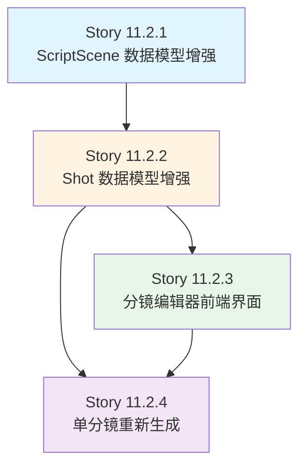

# Sub-Epic 11.2: 分镜编辑优化完整Story文档

**Epic名称:** 分镜编辑优化
**创建日期:** 2026-02-09
**基于文档:** Epic 11 - 漫剧生产系统需求
**总计Story数:** 4个
**总估算工作量:** 1-2周

---

## Story 11.2.1: ScriptScene 数据模型增强

**用户故事:**
作为漫剧编辑系统，
我需要增强 ScriptScene 数据模型以支持首尾帧、转场配置和场景继承，
以便实现专业的场景转场效果和场景资产复用。

**验收标准:**

### [场景1: 首尾帧字段添加]
**Given** 执行数据库迁移命令
**When** 添加 head_frame 和 tail_frame 字段到 ScriptScene 模型
**Then** 两个 ImageField 字段成功创建
**And** head_frame 上传路径为 'scenes/heads/'
**And** tail_frame 上传路径为 'scenes/tails/'
**And** 两个字段都允许为空 (blank=True, null=True)
**And** 迁移文件名为 '0002_add_scene_frames.py'

### [场景2: 转场配置字段添加]
**Given** ScriptScene 模型需要支持转场配置
**When** 添加转场相关字段
**Then** transition_to_next 字段创建 (ForeignKey到self，关联下一个场景)
**And** transition_type 字段创建 (CharField，choices包含fade/dissolve/wipe/cut)
**And** transition_duration 字段创建 (FloatField，默认值1.5秒)
**And** transition_to_next 允许为空 (blank=True, null=True)
**And** transition_type 默认为空字符串
**And** 相关数据库索引创建成功

### [场景3: 场景继承逻辑验证]
**Given** ScriptScene 继承自 PhysicalScene
**When** 创建 ScriptScene 实例并关联 physical_scene
**Then** ScriptScene 可以访问 PhysicalScene 的默认属性
**And** ScriptScene 可以覆盖 PhysicalScene 的属性 (atmosphere, time_of_day, weather)
**And** physical_scene 被删除时，ScriptScene 的 physical_scene 字段设置为 NULL (SET_NULL)
**And** PhysicalScene 的 default_lighting 和 default_atmosphere 可作为模板值

### [场景4: Django Admin 界面支持]
**Given** Django Admin 的 ScriptScene 配置
**When** 编辑 ScriptScene 实例
**Then** Admin 界面显示首尾帧上传控件
**And** Admin 界面显示转场配置表单 (转场目标、类型、时长)
**And** 转场类型使用下拉选择框显示
**And** 转场时长使用数字输入框 (支持小数)
**And** 所有字段都有清晰的中文 label 和 help_text

### [场景5: 字段验证逻辑]
**Given** 用户在 Admin 或 API 中修改 ScriptScene
**When** transition_type 字段设置为非空值
**And** transition_to_next 字段为空
**Then** 模型的 clean() 方法抛出 ValidationError
**And** 错误消息: "设置转场类型时必须指定转场目标场景"
**When** transition_duration 设置为负数或超过10秒
**Then** 验证错误: "转场时长必须在0-10秒之间"

### [场景6: 首尾帧文件上传验证]
**Given** 用户上传 head_frame 或 tail_frame 图片
**When** 文件格式不是 JPG/PNG
**Then** Django 验证器拒绝上传
**And** 错误消息: "只支持 JPG 和 PNG 格式"
**When** 文件大小超过 5MB
**Then** 上传失败并提示文件过大
**And** 错误消息: "图片大小不能超过 5MB"

### [场景7: 转场配置序列化]
**Given** DRF API 返回 ScriptScene 数据
**When** 序列化器包含转场配置
**Then** JSON 响应包含 transition_to_next_id (目标场景ID)
**And** 包含 transition_type (转场类型)
**And** 包含 transition_duration (转场时长)
**And** 包含 head_frame 和 tail_frame 的 URL
**And** 所有字段都是可读可写 (除系统自动生成字段外)

### [场景8: 单元测试覆盖]
**Given** 运行 ScriptScene 模型的单元测试
**When** 测试所有新增功能
**Then** 测试首尾帧字段创建和存储 ✅
**And** 测试转场配置字段创建和存储 ✅
**And** 测试场景继承逻辑 (访问和覆盖) ✅
**And** 测试字段验证逻辑 (转场目标、时长范围) ✅
**And** 测试文件上传验证 (格式、大小) ✅
**And** 测试覆盖率 > 90% ✅

**技术实现要点:**
- 在 apps/artworks/models.py 的 ScriptScene 模型中添加字段
- 使用 Django ImageField 存储首尾帧图片
- 使用 ForeignKey 到 self 实现转场目标关联
- 使用 models.TextChoices 定义转场类型枚举
- 实现模型 clean() 方法进行业务逻辑验证
- 使用 FileExtensionValidator 验证图片格式
- 创建数据库迁移文件 (makemigrations + migrate)
- 更新 ScriptSceneSerializer 包含新字段
- 配置 Django Admin 界面显示新字段
- 编写单元测试 (apps/artworks/tests/test_script_scene_models.py)

**数据模型字段定义:**
```python
class ScriptScene(TimeStampedModel):
    # 现有字段...

    # 首尾帧 (新增)
    head_frame = models.ImageField(
        upload_to='scenes/heads/',
        blank=True,
        null=True,
        validators=[FileExtensionValidator(['jpg', 'jpeg', 'png'])],
        verbose_name=_("首帧"),
        help_text=_("场景首帧图片，用于淡入效果")
    )
    tail_frame = models.ImageField(
        upload_to='scenes/tails/',
        blank=True,
        null=True,
        validators=[FileExtensionValidator(['jpg', 'jpeg', 'png'])],
        verbose_name=_("尾帧"),
        help_text=_("场景尾帧图片，用于淡出效果")
    )

    # 转场配置 (新增)
    class TransitionType(models.TextChoices):
        FADE = 'fade', _('淡入淡出')
        DISSOLVE = 'dissolve', _('溶解')
        WIPE = 'wipe', _('擦除')
        CUT = 'cut', _('切镜')

    transition_to_next = models.ForeignKey(
        'self',
        on_delete=models.SET_NULL,
        null=True,
        blank=True,
        related_name='transition_from_prev',
        verbose_name=_("转场目标"),
        help_text=_("转场到的下一个场景")
    )
    transition_type = models.CharField(
        max_length=20,
        choices=TransitionType.choices,
        blank=True,
        verbose_name=_("转场类型")
    )
    transition_duration = models.FloatField(
        default=1.5,
        validators=[MinValueValidator(0.0), MaxValueValidator(10.0)],
        verbose_name=_("转场时长(秒)"),
        help_text=_("转场动画持续时间，0-10秒")
    )

    def clean(self):
        """验证业务逻辑"""
        super().clean()
        if self.transition_type and not self.transition_to_next:
            raise ValidationError({
                'transition_to_next': _('设置转场类型时必须指定转场目标场景')
            })
```

**API 端点设计:**
- `GET /api/v1/artworks/scriptscenes/{id}/` - 获取场景详情 (包含首尾帧URL)
- `PUT /api/v1/artworks/scriptscenes/{id}/` - 更新场景 (支持首尾帧上传和转场配置)
- `POST /api/v1/artworks/scriptscenes/{id}/upload_head_frame/` - 上传首帧
- `POST /api/v1/artworks/scriptscenes/{id}/upload_tail_frame/` - 上传尾帧
- `DELETE /api/v1/artworks/scriptscenes/{id}/frames/` - 删除首尾帧

**前置条件:**
- ✅ Story 11.1 完成 (ScriptScene 基础模型存在)
- ✅ Django 项目正常运行
- ✅ PIL/Pillow 库已安装 (图片处理)

**依赖关系:**
- 依赖 Story 11.1 (基础数据模型)
- 被 Story 11.2.3 依赖 (前端界面需要完整的数据模型)

**估算:**
- 1.5天

**DoD:**
- [ ] ScriptScene 模型包含首尾帧字段 (head_frame, tail_frame)
- [ ] ScriptScene 模型包含转场配置字段 (transition_to_next, transition_type, transition_duration)
- [ ] 场景继承逻辑正常工作 (可访问和覆盖 PhysicalScene 属性)
- [ ] 数据库迁移文件生成并执行成功
- [ ] 模型 clean() 方法验证转场配置逻辑
- [ ] 图片上传验证器配置正确 (格式、大小)
- [ ] Django Admin 界面显示所有新字段
- [ ] DRF 序列化器包含所有新字段
- [ ] 单元测试覆盖率 > 90%
- [ ] 集成测试验证 API 端点功能
- [ ] 代码符合 SOLID 原则
- [ ] 代码符合 PEP8 规范

---

## Story 11.2.2: Shot 数据模型增强

**用户故事:**
作为漫剧编辑系统，
我需要增强 Shot 数据模型以支持角色造型关联、生成的图像和音频关联、运镜参数存储，
以便实现完整的分镜元数据管理和素材追踪。

**验收标准:**

### [场景1: 角色造型关联字段添加]
**Given** Shot 模型需要关联角色和造型
**When** 添加 character_pose 字段
**Then** ForeignKey 字段成功创建，指向 CharacterPose
**And** 允许为空 (blank=True, null=True)
**And** 删除策略为 SET_NULL (造型删除不影响镜头)
**And** related_name='shots' 配置正确
**And** 数据库迁移成功执行

### [场景2: 生成的图像和音频关联]
**Given** Shot 模型需要存储 AI 生成的内容
**When** 检查现有字段
**Then** generated_image 字段存在 (ImageField)
**And** generated_audio 字段存在 (FileField)
**And** 两个字段都允许为空
**And** generated_image 上传路径为 'shots/images/'
**And** generated_audio 上传路径为 'shots/audio/'
**And** 支持的音频格式包含 MP3/WAV (验证器配置)

### [场景3: 运镜参数存储增强]
**Given** Shot 模型需要存储详细的运镜参数
**When** 添加运镜相关字段
**Then** camera_movement 字段存在 (CharField，存储运镜类型)
**And** camera_angle 字段存在 (CharField，存储镜头角度)
**And** 添加 camera_movement_params 字段 (JSONField，存储运镜参数)
**And** camera_movement_params 格式示例: {"zoom": "1.5x", "pan": "left", "speed": "medium"}
**And** 添加 shot_composition 字段 (TextField，存储构图描述)
**And** 所有字段都允许为空 (向后兼容)

### [场景4: 生成状态追踪]
**Given** Shot 模型需要追踪内容生成状态
**When** 添加状态追踪字段
**Then** is_generated 字段存在 (BooleanField，默认False)
**And** generated_at 字段存在 (DateTimeField，允许为空)
**And** generation_error 字段存在 (TextField，存储生成错误信息)
**And** generation_retry_count 字段存在 (IntegerField，默认0)
**And** 所有状态字段添加成功

### [场景5: Django Admin 界面优化]
**Given** Django Admin 的 Shot 配置
**When** 编辑 Shot 实例
**Then** Admin 界面显示角色造型选择下拉框
**And** Admin 界面显示生成图像和音频的预览
**And** Admin 界面显示运镜参数编辑器 (JSON 编辑器或表单)
**And** Admin 界面显示生成状态徽章 (已生成/未生成/失败)
**And** Admin 列表页显示生成的缩略图

### [场景6: 字段验证逻辑]
**Given** 用户在 Admin 或 API 中修改 Shot
**When** camera_movement_params 包含无效的 JSON
**Then** 模型的 clean() 方法抛出 ValidationError
**And** 错误消息: "运镜参数格式错误，必须是有效的 JSON"
**When** generation_retry_count 设置为负数
**Then** 验证错误: "重试次数不能为负数"

### [场景7: 生成的文件访问]
**Given** Shot 已生成图像和音频
**When** 通过 API 访问 Shot 数据
**Then** JSON 响应包含 generated_image URL (完整路径)
**And** 包含 generated_audio URL
**And** URL 可直接用于前端展示和播放
**And** 文件不存在时 URL 为 null

### [场景8: 单元测试覆盖]
**Given** 运行 Shot 模型的单元测试
**When** 测试所有新增和修改的功能
**Then** 测试角色造型关联 ✅
**And** 测试生成的图像和音频字段 ✅
**And** 测试运镜参数 JSON 存储和验证 ✅
**And** 测试生成状态字段更新 ✅
**And** 测试字段验证逻辑 ✅
**And** 测试覆盖率 > 90% ✅

**技术实现要点:**
- 在 apps/artworks/models.py 的 Shot 模型中添加字段
- 使用 ForeignKey 关联 CharacterPose
- 使用 JSONField 存储运镜参数
- 实现模型 clean() 方法验证 JSON 格式
- 创建数据库迁移文件
- 更新 ShotSerializer 包含新字段
- 配置 Django Admin 界面 (使用 json_widget 编辑 JSONField)
- 编写单元测试 (apps/artworks/tests/test_shot_models.py)

**数据模型字段定义:**
```python
class Shot(TimeStampedModel):
    # 现有字段...
    scene = models.ForeignKey(ScriptScene, ...)
    shot_number = models.IntegerField(...)
    content = models.TextField(...)
    speaker = models.CharField(...)

    # 角色造型关联 (新增)
    character_pose = models.ForeignKey(
        'CharacterPose',
        on_delete=models.SET_NULL,
        null=True,
        blank=True,
        related_name='shots',
        verbose_name=_("角色造型"),
        help_text=_("镜头中使用的角色造型")
    )

    # 生成的图像和音频 (已存在，验证配置)
    generated_image = models.ImageField(
        upload_to='shots/images/',
        blank=True,
        null=True,
        verbose_name=_("生成的画面")
    )
    generated_audio = models.FileField(
        upload_to='shots/audio/',
        blank=True,
        null=True,
        validators=[FileExtensionValidator(['mp3', 'wav', 'm4a'])],
        verbose_name=_("生成的语音")
    )

    # 运镜参数 (新增)
    camera_movement_params = models.JSONField(
        default=dict,
        blank=True,
        verbose_name=_("运镜参数"),
        help_text=_("运镜详细参数，JSON格式")
    )
    shot_composition = models.TextField(
        blank=True,
        verbose_name=_("构图描述"),
        help_text=_("镜头构图和布局的详细描述")
    )

    # 生成状态追踪 (新增)
    generated_at = models.DateTimeField(
        null=True,
        blank=True,
        verbose_name=_("生成时间")
    )
    generation_error = models.TextField(
        blank=True,
        verbose_name=_("生成错误")
    )
    generation_retry_count = models.IntegerField(
        default=0,
        validators=[MinValueValidator(0)],
        verbose_name=_("重试次数")
    )

    def clean(self):
        """验证业务逻辑"""
        super().clean()
        # 验证运镜参数 JSON 格式
        if self.camera_movement_params:
            import json
            try:
                json.dumps(self.camera_movement_params)
            except (TypeError, ValueError) as e:
                raise ValidationError({
                    'camera_movement_params': _('运镜参数格式错误: %(error)s') % {'error': str(e)}
                })

    @property
    def is_successfully_generated(self):
        """是否成功生成"""
        return self.is_generated and self.generation_error == ''
```

**API 端点设计:**
- `GET /api/v1/artworks/shots/{id}/` - 获取镜头详情 (包含所有新字段)
- `PUT /api/v1/artworks/shots/{id}/` - 更新镜头 (支持所有新字段)
- `POST /api/v1/artworks/shots/{id}/upload_image/` - 上传生成的图像
- `POST /api/v1/artworks/shots/{id}/upload_audio/` - 上传生成的音频
- `GET /api/v1/artworks/shots/{id}/download_image/` - 下载生成的图像
- `GET /api/v1/artworks/shots/{id}/download_audio/` - 下载生成的音频
- `POST /api/v1/artworks/shots/{id}/regenerate/` - 重新生成 (Story 11.2.4)

**前置条件:**
- ✅ Story 11.1 完成 (Shot 基础模型存在)
- ✅ Story 11.2.1 完成 (ScriptScene 增强完成)
- ✅ CharacterPose 模型存在

**依赖关系:**
- 依赖 Story 11.1 (基础数据模型)
- 依赖 Story 11.2.1 (ScriptScene 增强)
- 被 Story 11.2.3 依赖 (前端界面需要完整的数据模型)
- 被 Story 11.2.4 依赖 (重新生成功能需要生成状态字段)

**估算:**
- 1.5天

**DoD:**
- [ ] Shot 模型包含 character_pose 字段
- [ ] Shot 模型包含 camera_movement_params 字段 (JSONField)
- [ ] Shot 模型包含 shot_composition 字段
- [ ] Shot 模型包含生成状态追踪字段 (generated_at, generation_error, generation_retry_count)
- [ ] generated_image 和 generated_audio 字段配置正确
- [ ] 模型 clean() 方法验证运镜参数 JSON 格式
- [ ] 数据库迁移文件生成并执行成功
- [ ] Django Admin 界面显示所有新字段
- [ ] DRF 序列化器包含所有新字段
- [ ] 单元测试覆盖率 > 90%
- [ ] 集成测试验证 API 端点功能
- [ ] 代码符合 SOLID 原则
- [ ] 代码符合 PEP8 规范

---

## Story 11.2.3: 分镜编辑器前端界面

**用户故事:**
作为漫剧编辑，
我需要一个可视化的分镜编辑器界面，支持故事板式展示、拖拽排序、快速编辑和批量操作，
以便高效地编辑和管理分镜内容。

**验收标准:**

### [场景1: 故事板式展示]
**Given** 用户访问章节的分镜编辑页面
**When** 页面加载完成
**Then** 显示故事板式网格布局 (类似 Adobe Story 或 Celtx)
**And** 每个镜头显示为卡片，包含缩略图、镜头号、内容预览
**And** 卡片显示镜头状态徽章 (已生成✓/未生成○/失败✗)
**And** 卡片显示镜头类型标签 (对话/旁白/动作)
**And** 支持响应式布局 (桌面3列、平板2列、手机1列)

### [场景2: 拖拽排序功能]
**Given** 故事板显示多个镜头卡片
**When** 用户拖拽镜头卡片到新位置
**Then** 卡片跟随鼠标移动，有视觉反馈
**And** 其他卡片自动让出空间
**And** 释放鼠标后，镜头排序更新
**And** 后端 API 调用更新 sort_order 字段
**And** 排序变化实时保存到数据库

### [场景3: 快速编辑表单]
**Given** 用户点击镜头卡片的编辑按钮
**When** 快速编辑弹窗打开
**Then** 弹窗显示镜头内容编辑框 (多行文本)
**And** 显示角色造型选择下拉框
**And** 显示运镜类型和角度选择器
**And** 显示运镜参数编辑器 (JSON 编辑器或表单)
**And** 显示时长滑块 (0.5-10秒)
**And** 显示保存和取消按钮
**And** 保存后自动关闭弹窗并更新卡片显示

### [场景4: 批量操作工具]
**Given** 用户选中多个镜头卡片 (复选框)
**When** 点击批量操作按钮
**Then** 显示批量操作菜单
**And** 支持"批量重新生成"选项
**And** 支持"批量删除"选项 (二次确认)
**And** 支持"批量修改时长"选项
**And** 支持"批量关联角色造型"选项
**And** 操作完成后显示成功提示

### [场景5: 镜头详情侧边栏]
**Given** 用户点击镜头卡片
**When** 镜头详情侧边栏从右侧滑出
**Then** 侧边栏显示完整的镜头信息
**And** 显示生成的图像预览 (大图)
**And** 显示音频播放器 (播放按钮、进度条、时长)
**And** 显示镜头完整内容 (对话/旁白/动作)
**And** 显示关联的角色造型信息
**And** 显示运镜参数和构图描述
**And** 显示生成历史 (生成时间、重试次数)

### [场景6: 场景转场配置界面]
**Given** 用户编辑场景 (ScriptScene)
**When** 打开转场配置标签页
**Then** 显示场景首尾帧上传区域
**And** 显示转场类型选择器 (淡入淡出/溶解/擦除/切镜)
**And** 显示转场目标场景选择器 (下拉框)
**And** 显示转场时长滑块 (0-10秒)
**And** 显示转场预览动画 (实时预览效果)
**And** 保存后更新场景转场配置

### [场景7: 响应式设计]
**Given** 用户在不同设备上访问
**When** 在桌面浏览器 (宽度>1200px)
**Then** 故事板显示3列布局
**And** 侧边栏宽度固定为400px
**When** 在平板设备 (768px<宽度<1200px)
**Then** 故事板显示2列布局
**And** 侧边栏宽度固定为300px
**When** 在手机设备 (宽度<768px)
**Then** 故事板显示1列布局
**And** 侧边栏全屏显示，带关闭按钮

### [场景8: E2E测试覆盖]
**Given** 运行前端 E2E 测试
**When** 测试所有交互功能
**Then** 测试故事板加载和显示 ✅
**And** 测试拖拽排序功能 ✅
**And** 测试快速编辑表单 ✅
**And** 测试批量操作功能 ✅
**And** 测试侧边栏打开关闭 ✅
**And** 测试转场配置界面 ✅
**And** 测试响应式布局 ✅
**And** 所有测试通过 ✅

**技术实现要点:**
- 使用 Vue 2.7 + Vuex 构建组件
- 使用 vue-draggable 或 Sortable.js 实现拖拽排序
- 使用 Tailwind CSS 实现响应式布局
- 使用 daisyUI 组件库美化界面
- 使用 axios 调用后端 API
- 使用 Vue Router 管理路由
- 使用 JSONEditor 或 CodeMirror 编辑运镜参数
- 使用 VuePerfectScrollbar 自定义滚动条
- 实现文件上传组件 (首尾帧、图像、音频)
- 实现 H5 音频播放器 (自定义样式)
- 编写 E2E 测试 (Cypress 或 Playwright)

**前端组件结构:**
```
frontend/src/views/artworks/
├── StoryboardEditor.vue          # 故事板编辑器主页面
├── components/
│   ├── ShotCard.vue              # 镜头卡片组件
│   ├── ShotDetailSidebar.vue     # 镜头详情侧边栏
│   ├── QuickEditModal.vue        # 快速编辑弹窗
│   ├── SceneTransitionPanel.vue  # 场景转场配置面板
│   ├── BatchOperationsBar.vue    # 批量操作工具栏
│   ├── ImagePreview.vue          # 图像预览组件
│   └── AudioPlayer.vue           # 音频播放器组件
└── store/
    └── modules/
        └── storyboard.js         # 故事板状态管理
```

**核心组件示例:**
```vue
<!-- ShotCard.vue -->
<template>
  <div
    class="shot-card"
    :class="{ 'selected': isSelected, 'generated': shot.is_generated }"
    @click="showDetail"
  >
    <!-- 状态徽章 -->
    <div class="status-badge" :class="statusClass">
      {{ statusText }}
    </div>

    <!-- 缩略图 -->
    <div class="thumbnail">
      
      <div v-else class="placeholder">
        <span class="shot-number">{{ shot.shot_number }}</span>
      </div>
    </div>

    <!-- 内容预览 -->
    <div class="content-preview">
      <p class="shot-type">{{ shotTypeText }}</p>
      <p class="shot-content">{{ truncatedContent }}</p>
    </div>

    <!-- 时长 -->
    <div class="duration">
      {{ shot.duration }}s
    </div>
  </div>
</template>

<script>
export default {
  props: ['shot', 'isSelected'],
  computed: {
    statusClass() {
      if (this.shot.generation_error) return 'error';
      if (this.shot.is_generated) return 'success';
      return 'pending';
    },
    statusText() {
      if (this.shot.generation_error) return '失败';
      if (this.shot.is_generated) return '已生成';
      return '未生成';
    },
    truncatedContent() {
      return this.shot.content.length > 50
        ? this.shot.content.slice(0, 50) + '...'
        : this.shot.content;
    }
  },
  methods: {
    showDetail() {
      this.$emit('show-detail', this.shot);
    }
  }
}
</script>
```

**API 调用示例:**
```javascript
// 获取章节的所有镜头
async fetchShots(chapterId) {
  const response = await axios.get(
    `/api/v1/artworks/chapters/${chapterId}/shots/`
  );
  this.shots = response.data.results;
}

// 更新镜头排序
async updateShotOrder(shotId, newOrder) {
  await axios.patch(
    `/api/v1/artworks/shots/${shotId}/`,
    { sort_order: newOrder }
  );
}

// 批量操作
async batchRegenerate(shotIds) {
  await axios.post('/api/v1/artworks/shots/batch_regenerate/', {
    shot_ids: shotIds
  });
}
```

**前置条件:**
- ✅ Story 11.2.1 完成 (ScriptScene 数据模型)
- ✅ Story 11.2.2 完成 (Shot 数据模型)
- ✅ 前端项目正常运行 (Vue + Vuex + Vue Router)
- ✅ 后端 API 端点已实现

**依赖关系:**
- 依赖 Story 11.2.1 (ScriptScene 数据模型增强)
- 依赖 Story 11.2.2 (Shot 数据模型增强)
- 依赖后端 API (所有 CRUD 和操作端点)

**估算:**
- 3-4天

**DoD:**
- [ ] StoryboardEditor 主页面实现
- [ ] ShotCard 组件实现 (显示镜头卡片)
- [ ] 拖拽排序功能实现 (vue-draggable 或 Sortable.js)
- [ ] ShotDetailSidebar 组件实现 (侧边栏详情)
- [ ] QuickEditModal 组件实现 (快速编辑弹窗)
- [ ] BatchOperationsBar 组件实现 (批量操作)
- [ ] SceneTransitionPanel 组件实现 (场景转场配置)
- [ ] ImagePreview 组件实现 (图像预览)
- [ ] AudioPlayer 组件实现 (音频播放器)
- [ ] Vuex store 状态管理实现
- [ ] 响应式布局实现 (Tailwind CSS)
- [ ] E2E 测试通过 (所有交互功能)
- [ ] 前端代码符合 Vue 2.7 规范
- [ ] 前端代码符合项目现有风格
- [ ] 所有组件有完整的 props 和 events 定义

---

## Story 11.2.4: 单分镜重新生成

**用户故事:**
作为漫剧编辑，
我希望能够单独重新生成某个分镜的内容（图像和音频），
以便在不影响其他分镜的情况下调整和优化单个镜头。

**验收标准:**

### [场景1: 单镜头重新生成 API]
**Given** 用户请求重新生成镜头ID=5
**When** 调用 POST /api/v1/artworks/shots/5/regenerate/
**Then** API 返回 202 Accepted
**And** 触发 Celery 异步任务 regenerate_shot_content
**And** 任务接收 shot_id 作为参数
**And** 任务在 'image' 和 'audio' 队列中执行
**And** 前端通过 WebSocket 接收生成进度

### [场景2: 参数快速调整]
**Given** 用户在重新生成弹窗中
**When** 打开高级选项
**Then** 显示可调整的参数列表
**And** 可以修改图像生成提示词
**And** 可以修改角色造型 (character_pose)
**And** 可以修改运镜参数 (camera_movement_params)
**And** 可以修改时长 (duration)
**And** 可以选择是否重新生成图像 (复选框)
**And** 可以选择是否重新生成音频 (复选框)
**And** 参数验证通过后才能提交

### [场景3: 不影响其他分镜]
**Given** 项目包含10个镜头
**When** 重新生成镜头ID=5
**Then** 只有镜头ID=5的状态变为 'processing'
**And** 其他镜头状态保持不变
**And** 其他镜头的生成文件不受影响
**And** 重新生成完成后，只有镜头ID=5的文件被替换
**And** 任务日志中记录重新生成操作

### [场景4: 生成失败重试逻辑]
**Given** 镜头生成失败 (generation_error 有内容)
**When** 用户点击"重试"按钮
**Then** 调用重新生成 API
**And** generation_retry_count 字段增加1
**And** 当 generation_retry_count < 3 时，自动重试
**And** 当 generation_retry_count >= 3 时，停止重试并标记为失败
**And** 错误信息更新到 generation_error 字段

### [场景5: 生成进度实时推送]
**Given** Celery 任务正在执行
**When** 生成进度更新
**Then** 通过 Redis Pub/Sub 推送进度消息
**And** WebSocket 连接接收消息
**And** 前端更新进度条显示
**And** 消息格式: {"type": "progress", "shot_id": 5, "progress": 50, "message": "正在生成图像..."}

### [场景6: 前端重新生成界面]
**Given** 用户点击镜头卡片的"重新生成"按钮
**When** 重新生成弹窗打开
**Then** 弹窗显示当前镜头信息
**And** 显示可调整的参数表单
**And** 显示"生成图像"和"生成音频"复选框
**And** 显示"确认"和"取消"按钮
**And** 点击确认后，按钮显示加载状态
**And** 生成完成后显示成功提示
**And** 镜头卡片自动更新显示新生成的内容

### [场景7: 批量重新生成]
**Given** 用户选中5个镜头
**When** 点击"批量重新生成"按钮
**Then** 弹窗显示选中的镜头列表
**And** 显示通用参数表单 (应用于所有镜头)
**And** 点击确认后，依次提交5个重新生成请求
**And** 每个镜头独立执行重新生成任务
**And** 显示整体进度 (已完成1/5)
**And** 所有任务完成后显示汇总提示

### [场景8: 单元测试和集成测试]
**Given** 运行测试套件
**When** 测试重新生成功能
**Then** 测试 API 端点 (POST /regenerate/) ✅
**And** 测试 Celery 任务执行 ✅
**And** 测试参数验证逻辑 ✅
**And** 测试重试计数器 ✅
**And** 测试进度推送机制 ✅
**And** 集成测试验证完整流程 ✅
**And** 测试覆盖率 > 85% ✅

**技术实现要点:**
- 在 apps/artworks/views.py 添加 regenerate action
- 创建 Celery 任务 regenerate_shot_content (apps/artworks/tasks.py)
- 实现参数验证序列化器 (RegenerateShotSerializer)
- 实现 WebSocket 进度推送 (consumers.py)
- 创建重新生成参数表单组件 (RegenerateModal.vue)
- 实现前端 API 调用 (artworks service)
- 使用 Redis Pub/Sub 推送进度
- 实现任务队列管理 (image 队列、audio 队列)
- 编写单元测试和集成测试

**后端 API 实现:**
```python
# views.py
from rest_framework.decorators import action
from rest_framework.response import Response
from .tasks import regenerate_shot_content

class ShotViewSet(viewsets.ModelViewSet):
    @action(detail=True, methods=['post'])
    def regenerate(self, request, pk=None):
        """重新生成镜头内容"""
        shot = self.get_object()

        # 验证参数
        serializer = RegenerateShotSerializer(data=request.data)
        serializer.is_valid(raise_exception=True)

        # 触发异步任务
        task = regenerate_shot_content.delay(
            shot_id=shot.id,
            regenerate_image=serializer.validated_data.get('regenerate_image', True),
            regenerate_audio=serializer.validated_data.get('regenerate_audio', True),
            override_params=serializer.validated_data.get('override_params', {})
        )

        return Response({
            'task_id': task.id,
            'message': '重新生成任务已启动'
        }, status=202)

# tasks.py
@app.task(bind=True, max_retries=3)
def regenerate_shot_content(self, shot_id, regenerate_image=True, regenerate_audio=True, override_params=None):
    """重新生成镜头内容"""
    shot = Shot.objects.get(id=shot_id)

    # 更新状态
    shot.is_generated = False
    shot.generation_error = ''
    shot.generation_retry_count += 1
    shot.save()

    # 推送进度
    publisher = RedisStreamPublisher(f'shot_{shot_id}')
    publisher.publish({
        'type': 'progress',
        'progress': 0,
        'message': '开始重新生成...'
    })

    try:
        # 生成图像
        if regenerate_image:
            publisher.publish({'type': 'progress', 'progress': 25, 'message': '正在生成图像...'})
            image_service = ImageGenerationService()
            shot.generated_image = image_service.generate(shot, override_params)

        # 生成音频
        if regenerate_audio:
            publisher.publish({'type': 'progress', 'progress': 75, 'message': '正在生成音频...'})
            audio_service = AudioGenerationService()
            shot.generated_audio = audio_service.generate(shot, override_params)

        # 更新状态
        shot.is_generated = True
        shot.generated_at = timezone.now()
        shot.save()

        publisher.publish({'type': 'completed', 'progress': 100, 'message': '生成完成'})

    except Exception as e:
        shot.generation_error = str(e)
        shot.save()
        publisher.publish({'type': 'error', 'message': f'生成失败: {str(e)}'})
        raise
```

**前端组件实现:**
```vue
<!-- RegenerateModal.vue -->
<template>
  <div class="modal">
    <h3>重新生成镜头 #{{ shot.shot_number }}</h3>

    <!-- 生成选项 -->
    <div class="form-group">
      <label>
        <input type="checkbox" v-model="regenerateImage" />
        重新生成图像
      </label>
      <label>
        <input type="checkbox" v-model="regenerateAudio" />
        重新生成音频
      </label>
    </div>

    <!-- 高级参数 -->
    <div v-if="showAdvanced" class="advanced-options">
      <div class="form-group">
        <label>图像提示词</label>
        <textarea v-model="overrideParams.image_prompt" />
      </div>
      <div class="form-group">
        <label>角色造型</label>
        <select v-model="overrideParams.character_pose_id">
          <option v-for="pose in poses" :value="pose.id">
            {{ pose.pose_name }}
          </option>
        </select>
      </div>
    </div>

    <!-- 按钮 -->
    <div class="actions">
      <button @click="cancel">取消</button>
      <button @click="confirm" :disabled="isSubmitting">
        {{ isSubmitting ? '生成中...' : '确认' }}
      </button>
    </div>
  </div>
</template>

<script>
export default {
  props: ['shot'],
  data() {
    return {
      regenerateImage: true,
      regenerateAudio: true,
      showAdvanced: false,
      overrideParams: {},
      isSubmitting: false
    };
  },
  methods: {
    async confirm() {
      this.isSubmitting = true;
      try {
        await this.$http.post(`/api/v1/artworks/shots/${this.shot.id}/regenerate/`, {
          regenerate_image: this.regenerateImage,
          regenerate_audio: this.regenerateAudio,
          override_params: this.overrideParams
        });
        this.$emit('regenerate-started');
        this.$notify.success('重新生成任务已启动');
      } catch (error) {
        this.$notify.error('启动失败: ' + error.message);
      } finally {
        this.isSubmitting = false;
      }
    },
    cancel() {
      this.$emit('close');
    }
  }
};
</script>
```

**API 端点设计:**
- `POST /api/v1/artworks/shots/{id}/regenerate/` - 重新生成单个镜头
- `POST /api/v1/artworks/shots/batch_regenerate/` - 批量重新生成
- `GET /api/v1/artworks/shots/{id}/regenerate_status/` - 获取重新生成状态

**WebSocket 订阅:**
```javascript
// 订阅镜头生成进度
const ws = new WebSocket(`ws://localhost:8000/ws/shots/${shotId}/regenerate/`);

ws.onmessage = (event) => {
  const data = JSON.parse(event.data);
  if (data.type === 'progress') {
    this.progress = data.progress;
    this.message = data.message;
  } else if (data.type === 'completed') {
    this.$notify.success('生成完成');
    this.refreshShot();
  } else if (data.type === 'error') {
    this.$notify.error('生成失败: ' + data.message);
  }
};
```

**前置条件:**
- ✅ Story 11.2.2 完成 (Shot 数据模型增强，包含生成状态字段)
- ✅ Story 11.2.3 完成 (分镜编辑器前端界面)
- ✅ Celery 任务队列配置正确
- ✅ Redis Pub/Sub 配置正确

**依赖关系:**
- 依赖 Story 11.2.2 (Shot 数据模型增强)
- 依赖 Story 11.2.3 (前端编辑器界面)
- 依赖 Celery 任务系统
- 依赖 WebSocket 实时通信

**估算:**
- 2-3天

**DoD:**
- [ ] regenerate API 端点实现 (POST /regenerate/)
- [ ] batch_regenerate API 端点实现
- [ ] regenerate_shot_content Celery 任务实现
- [ ] RegenerateShotSerializer 参数验证实现
- [ ] WebSocket 进度推送实现
- [ ] 前端 RegenerateModal 组件实现
- [ ] 前端 API 调用实现
- [ ] 生成进度条显示实现
- [ ] 单元测试覆盖率 > 85%
- [ ] 集成测试验证完整流程
- [ ] 重试逻辑测试通过
- [ ] 代码符合 SOLID 原则
- [ ] 代码符合 PEP8/Vue 规范

---

## 附录：Story 依赖关系图



**依赖说明:**
- Story 11.2.1 和 11.2.2 可并行开发 (都是数据模型增强)
- Story 11.2.3 依赖 11.2.1 和 11.2.2 (前端需要完整的数据模型)
- Story 11.2.4 依赖 11.2.2 (需要 Shot 数据模型的生成状态字段) 和 11.2.3 (需要前端界面)

---

## 附录：数据模型变更汇总

### ScriptScene 模型新增字段
| 字段名 | 类型 | 说明 | 默认值 |
|-------|------|------|--------|
| head_frame | ImageField | 场景首帧图片 | NULL |
| tail_frame | ImageField | 场景尾帧图片 | NULL |
| transition_to_next | ForeignKey(self) | 转场目标场景 | NULL |
| transition_type | CharField | 转场类型 (fade/dissolve/wipe/cut) | '' |
| transition_duration | FloatField | 转场时长(秒) | 1.5 |

### Shot 模型新增字段
| 字段名 | 类型 | 说明 | 默认值 |
|-------|------|------|--------|
| character_pose | ForeignKey(CharacterPose) | 关联角色造型 | NULL |
| camera_movement_params | JSONField | 运镜详细参数 | {} |
| shot_composition | TextField | 构图描述 | '' |
| generated_at | DateTimeField | 生成时间 | NULL |
| generation_error | TextField | 生成错误信息 | '' |
| generation_retry_count | IntegerField | 重试次数 | 0 |

---

## 附录：API 端点汇总

### ScriptScene 相关
- `GET /api/v1/artworks/scriptscenes/{id}/` - 获取场景详情
- `PUT /api/v1/artworks/scriptscenes/{id}/` - 更新场景
- `POST /api/v1/artworks/scriptscenes/{id}/upload_head_frame/` - 上传首帧
- `POST /api/v1/artworks/scriptscenes/{id}/upload_tail_frame/` - 上传尾帧
- `DELETE /api/v1/artworks/scriptscenes/{id}/frames/` - 删除首尾帧

### Shot 相关
- `GET /api/v1/artworks/shots/{id}/` - 获取镜头详情
- `PUT /api/v1/artworks/shots/{id}/` - 更新镜头
- `POST /api/v1/artworks/shots/{id}/upload_image/` - 上传图像
- `POST /api/v1/artworks/shots/{id}/upload_audio/` - 上传音频
- `GET /api/v1/artworks/shots/{id}/download_image/` - 下载图像
- `GET /api/v1/artworks/shots/{id}/download_audio/` - 下载音频
- `POST /api/v1/artworks/shots/{id}/regenerate/` - 重新生成
- `POST /api/v1/artworks/shots/batch_regenerate/` - 批量重新生成
- `GET /api/v1/artworks/shots/{id}/regenerate_status/` - 获取生成状态

---

## 附录：测试策略

### 单元测试
- **模型测试**: 测试 ScriptScene 和 Shot 的字段验证、保存逻辑
- **序列化器测试**: 测试 API 请求/响应的序列化和验证
- **任务测试**: 测试 Celery 任务的执行逻辑和重试机制
- **覆盖率目标**: > 90%

### 集成测试
- **API 测试**: 测试所有 API 端点的 CRUD 操作
- **文件上传测试**: 测试图像和音频上传流程
- **重新生成测试**: 测试完整的重新生成流程
- **覆盖率目标**: > 85%

### E2E 测试
- **前端交互测试**: 测试拖拽排序、快速编辑、批量操作
- **响应式测试**: 测试不同设备上的布局
- **实时通信测试**: 测试 WebSocket 进度推送
- **覆盖率目标**: 核心流程 100%

---

## 附录：前端路由配置

```javascript
// router/index.js
{
  path: '/artworks/:artworkId/chapters/:chapterId/storyboard',
  name: 'storyboard-editor',
  component: () => import('@/views/artworks/StoryboardEditor.vue'),
  meta: {
    title: '分镜编辑器',
    requiresAuth: true
  }
}
```

---

## 附录：Vuex Store 配置

```javascript
// store/modules/storyboard.js
export default {
  namespaced: true,

  state: {
    shots: [],
    selectedShotIds: [],
    currentShot: null,
    isLoading: false,
    progress: {}
  },

  mutations: {
    SET_SHOTS(state, shots) {
      state.shots = shots;
    },
    SELECT_SHOT(state, shotId) {
      state.currentShot = state.shots.find(s => s.id === shotId);
    },
    UPDATE_SHOT(state, shot) {
      const index = state.shots.findIndex(s => s.id === shot.id);
      if (index !== -1) {
        state.shots.splice(index, 1, shot);
      }
    },
    SET_PROGRESS(state, { shotId, progress }) {
      state.progress = { ...state.progress, [shotId]: progress };
    }
  },

  actions: {
    async fetchShots({ commit }, chapterId) {
      const response = await api.get(`/artworks/chapters/${chapterId}/shots/`);
      commit('SET_SHOTS', response.data.results);
    },
    async updateShot({ commit }, { shotId, data }) {
      const response = await api.patch(`/artworks/shots/${shotId}/`, data);
      commit('UPDATE_SHOT', response.data);
    },
    async regenerateShot({ dispatch }, { shotId, params }) {
      await api.post(`/artworks/shots/${shotId}/regenerate/`, params);
      // WebSocket 会更新进度
    }
  }
};
```

---

**文档版本:** 1.0
**创建日期:** 2026-02-09
**状态:** Ready for Implementation
**总估算:** 1-2周 (4个Story)

---

## 变更记录

| 版本 | 日期 | 变更内容 | 作者 |
|------|------|---------|------|
| 1.0 | 2026-02-09 | Sub-Epic 11.2初始版本（4个Story） | BMAD Create-Story Workflow |
