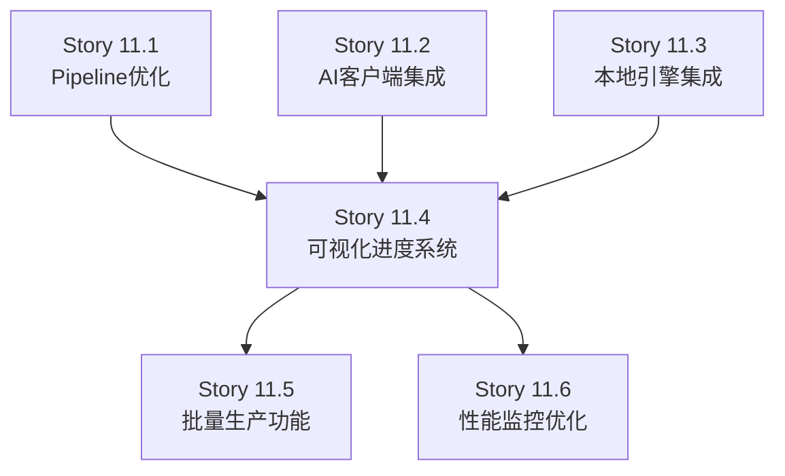
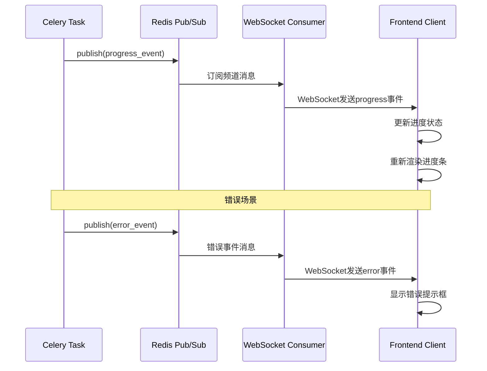
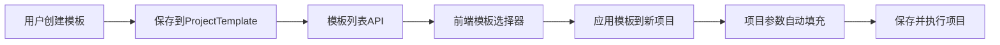

# Story 11.4: 可视化进度系统

**Story ID:** 11.4
**Story Key:** 11-4-progress-visualization
**Epic:** Epic 11 - 漫剧生产系统优化
**Status:** pending
**创建日期:** 2026-02-09
**估算工作量:** 1周（5个工作日）
**优先级:** ⭐⭐⭐

---

## Story概述

作为内容创作者，
我想要看到可视化的生产进度实时反馈（阶段进度条、百分比显示、预估剩余时间），
以便准确掌握漫剧生成状态并合理安排后续工作。

---

## Acceptance Criteria

### AC1: 实时进度条组件

**场景1: 阶段进度条显示**
Given 项目正在执行生成任务
When 查看项目详情页
Then 显示5阶段进度条（文案改写、分镜生成、文生图、运镜生成、图生视频）
And 当前执行阶段高亮显示
And 已完成阶段显示为绿色
And 进行中阶段显示为蓝色（带动画）
And 未开始阶段显示为灰色

**场景2: 百分比显示**
Given 阶段进度条渲染
When 查看任意阶段
Then 显示当前阶段完成百分比（0-100%）
And 百分比数值跟随实时更新
And 显示当前步骤信息（如"步骤 3/10：生成场景描述"）

**场景3: 预估剩余时间**
Given 任务执行中
When 查看进度区域
Then 显示预估剩余时间（如"预计剩余 2分30秒"）
And 时间显示基于历史执行数据动态计算
And 时间格式化（秒转分钟/小时）

**场景4: 进度条动画**
Given 阶段进度从0%变化到100%
When 观察进度条
Then 进度条平滑过渡（CSS transition动画）
And 动画持续时间300ms
And 进度条颜色渐变（蓝色→紫色→绿色）

### AC2: WebSocket 进度推送优化

**场景1: 细粒度进度事件**
Given Celery任务执行中
When 任务进度更新
Then 通过WebSocket推送progress事件
And 事件包含：stage（阶段名）、percentage（百分比）、current_step（当前步骤）、total_steps（总步骤数）
And 推送频率：每5%或每步骤完成时更新
And 推送延迟 < 100ms

**场景2: 错误消息推送**
Given 任务执行失败
When 捕获到异常
Then 通过WebSocket推送error事件
And 事件包含：stage、error_message（错误信息）、error_type（错误类型）、timestamp（时间戳）
And 前端显示错误提示框
And 错误提示可关闭并记录到日志

**场景3: 阶段完成通知**
Given 阶段执行完成
When 最后一步完成
Then 通过WebSocket推送stage_complete事件
And 事件包含：stage_name、duration（耗时）、output_count（输出数量）
And 前端显示阶段完成动画（✓图标）
And 自动进入下一阶段进度显示

**场景4: WebSocket连接管理**
Given 用户打开项目详情页
When 建立WebSocket连接
Then 连接路径：ws://localhost:8000/ws/projects/{project_id}/progress/
And 支持重连机制（连接断开后3秒自动重连）
And 连接失败时降级到HTTP轮询（每5秒）

### AC3: 预设模板系统

**场景1: 参数模板存储**
Given 用户配置了项目参数
When 保存为预设模板
Then 模板包含：name（模板名）、description（描述）、parameters（参数JSON）、created_at（创建时间）
And 模板存储到ProjectTemplate模型
And 支持最多20个用户自定义模板

**场景2: 快速应用预设**
Given 用户创建新项目
When 选择预设模板
Then 自动填充模板参数到表单
And 参数包括：style（风格）、quality（质量）、aspect_ratio（宽高比）、llm_provider、image_provider、video_provider
And 用户可修改预设参数后保存

**场景3: 用户自定义模板**
Given Django Admin模板管理页面
When 访问/admin/projects/projecttemplate/
Then 显示所有预设模板（系统预置+用户自定义）
And 支持创建、编辑、删除自定义模板
And 系统预置模板不可删除（如"漫画风格-高质量"）
And 支持模板搜索和筛选

**场景4: 模板权限控制**
Given 普通用户登录
When 访问模板API
Then 只能看到自己创建的模板和系统预置模板
And 不能修改或删除系统预置模板
And 管理员可以管理所有模板

---

## Tasks / Subtasks

### Task 1: 实时进度条组件实现（AC1）
**估算:** 1.5天
**负责人:** 前端开发

- [x] Subtask 1.1: 创建StageProgress组件
  - [x] 接收props: stages（阶段列表）、currentStage（当前阶段）、progress（进度百分比）
  - [x] 渲染5阶段水平进度条（使用flex布局）
  - [x] 阶段状态样式：completed（绿色）、active（蓝色+动画）、pending（灰色）

- [x] Subtask 1.2: 实现百分比显示
  - [x] ProgressText组件显示当前阶段百分比（0-100%）
  - [x] StepInfo组件显示"步骤 X/Y：{步骤名称}"
  - [x] 实时更新逻辑（WebSocket事件驱动）

- [x] Subtask 1.3: 实现预估剩余时间
  - [x] TimeRemaining组件计算并显示剩余时间
  - [x] 算法：基于历史平均耗时 * (100% - current_percentage) / 100
  - [x] 时间格式化：毫秒→秒/分钟/小时

- [x] Subtask 1.4: 进度条动画优化
  - [x] CSS transition动画（width属性，300ms ease）
  - [x] 颜色渐变（linear-gradient: blue → purple → green）
  - [x] 阶段切换动画（fade-in/fade-out）

### Task 2: WebSocket 进度推送优化（AC2）
**估算:** 2天
**负责人:** 后端开发 + 前端开发

- [x] Subtask 2.1: 后端进度事件定义
  - [x] 在apps/projects/consumers.py中定义3种事件类型
  - [x] progress事件：{"type": "progress", "stage": "llm", "percentage": 35, "current_step": 3, "total_steps": 10}
  - [x] error事件：{"type": "error", "stage": "image_generation", "error_message": "API timeout", "timestamp": "2026-02-09T10:30:00Z"}
  - [x] stage_complete事件：{"type": "stage_complete", "stage_name": "llm", "duration": 45, "output_count": 10}

- [x] Subtask 2.2: Celery任务集成进度推送
  - [x] 在core/pipeline/base.py中添加progress_callback参数
  - [x] PipelineProcessor发送进度到Redis Pub/Sub
  - [x] WebSocketConsumer订阅Redis频道并转发给前端
  - [x] 推送频率控制（每5%或每步骤）

- [x] Subtask 2.3: 前端WebSocket客户端优化
  - [x] 在frontend/src/services/websocket.js中实现ProgressWebSocketClient类
  - [x] 事件监听：onProgress、onError、onStageComplete
  - [x] 自动重连机制（连接断开后3秒重试，最多5次）
  - [x] 降级到HTTP轮询（WebSocket失败时）

- [x] Subtask 2.4: 错误处理和显示
  - [x] ErrorNotification组件显示错误提示框
  - [x] 错误日志记录（存储到Vuex store）
  - [x] 错误提示可关闭并支持复制错误信息

### Task 3: 预设模板系统实现（AC3）
**估算:** 1.5天
**负责人:** 全栈开发

- [x] Subtask 3.1: 数据模型创建
  - [x] 在apps/projects/models.py中添加ProjectTemplate模型
  - [x] 字段：name、description、parameters（JSONField）、is_system_template（BooleanField）、created_by（ForeignKey）、created_at
  - [x] 数据库迁移：makemigrations + migrate

- [x] Subtask 3.2: API接口实现
  - [x] ProjectTemplateViewSet（list、retrieve、create、update、destroy）
  - [x] 权限控制：IsAuthenticated + IsOwnerOrReadOnly
  - [x] 序列化器：ProjectTemplateSerializer（包含parameters验证）

- [x] Subtask 3.3: 前端模板管理
  - [x] TemplateSelector组件（下拉框选择模板）
  - [x] TemplateManager组件（管理我的模板）
  - [x] 应用模板时自动填充表单（响应式数据绑定）

- [x] Subtask 3.4: Django Admin界面
  - [x] ProjectTemplateAdmin配置（list_display、list_filter、search_fields）
  - [x] 系统预置模板保护（is_system_template=True时不可删除）
  - [x] 用户权限控制（普通用户只能管理自己的模板）

---

## Dev Notes

### 🎯 Epic 11 上下文

**Epic目标:** 优化漫剧生产系统的用户体验和生产效率。

**技术栈:**
- 后端: Django 3.2.15 + DRF + Celery + Redis + Channels
- 前端: Vue 2.7.14 + Vuex + daisyUI 4.12.23 + Tailwind CSS 3.4.17
- WebSocket: Django Channels (Redis作为消息层)

**依赖关系:**
- Story 11.4 依赖 Story 11.1-11.3（Pipeline优化、AI客户端集成、本地引擎集成）
- Story 11.4 为后续Story（UI优化、测试、部署）提供基础

### 🏗️ 架构要求

**前端组件架构:**
```
frontend/src/components/progress/
├── StageProgress.vue          # 阶段进度条组件
├── ProgressText.vue           # 百分比显示组件
├── StepInfo.vue               # 步骤信息组件
├── TimeRemaining.vue          # 剩余时间组件
└── ErrorNotification.vue      # 错误提示组件
```

**WebSocket协议设计:**
```javascript
// 连接路径
ws://localhost:8000/ws/projects/{project_id}/progress/

// 事件类型
1. progress事件
{
  "type": "progress",
  "stage": "llm",              // llm, image, video
  "percentage": 35,            // 0-100
  "current_step": 3,
  "total_steps": 10,
  "step_name": "生成场景描述"
}

2. error事件
{
  "type": "error",
  "stage": "image_generation",
  "error_message": "API timeout: Stable Diffusion",
  "error_type": "TimeoutException",
  "timestamp": "2026-02-09T10:30:00Z"
}

3. stage_complete事件
{
  "type": "stage_complete",
  "stage_name": "llm",
  "duration": 45,              // 秒
  "output_count": 10,          // 输出数量
  "next_stage": "image_generation"
}
```

**数据模型设计:**
```python
# apps/projects/models.py

class ProjectTemplate(models.Model):
    """项目预设模板"""
    name = models.CharField(max_length=100, verbose_name="模板名称")
    description = models.TextField(blank=True, verbose_name="描述")
    parameters = models.JSONField(verbose_name="参数配置")
    is_system_template = models.BooleanField(default=False, verbose_name="系统预置")
    created_by = models.ForeignKey(
        settings.AUTH_USER_MODEL,
        on_delete=models.CASCADE,
        related_name='project_templates',
        verbose_name="创建者"
    )
    created_at = models.DateTimeField(auto_now_add=True, verbose_name="创建时间")

    class Meta:
        verbose_name = "项目模板"
        verbose_name_plural = "项目模板"
        ordering = ['-created_at']
```

### 📁 Project Structure Notes

**新增文件:**
```
backend/
├── apps/projects/
│   ├── models.py                       # 添加ProjectTemplate模型
│   ├── migrations/
│   │   └── 0005_add_project_template.py  # 模板迁移文件
│   ├── serializers.py                  # 添加ProjectTemplateSerializer
│   ├── admin.py                        # 添加ProjectTemplateAdmin
│   └── views.py                        # 添加ProjectTemplateViewSet

frontend/src/
├── components/
│   └── progress/
│       ├── StageProgress.vue           # 阶段进度条
│       ├── ProgressText.vue            # 百分比显示
│       ├── StepInfo.vue                # 步骤信息
│       ├── TimeRemaining.vue           # 剩余时间
│       └── ErrorNotification.vue       # 错误提示
├── services/
│   └── websocket.js                    # WebSocket客户端（优化）
└── store/
    └── modules/
        └── progress.js                 # 进度状态管理
```

**修改文件:**
- `backend/apps/projects/consumers.py` - 添加进度事件推送
- `backend/core/pipeline/base.py` - 添加progress_callback支持
- `frontend/src/views/projects/ProjectDetail.vue` - 集成进度组件
- `frontend/src/router/index.js` - 添加模板管理路由

### 🧪 Testing Standards Summary

**单元测试:**
- StageProgress组件测试（渲染、状态切换、动画）
- TimeRemaining组件测试（时间计算、格式化）
- ProjectTemplate模型测试（CRUD、权限控制）
- WebSocket消费者测试（事件推送、重连逻辑）

**集成测试:**
- 端到端进度流程测试（Celery任务 → WebSocket → 前端显示）
- 模板应用流程测试（创建模板 → 应用模板 → 项目创建）

**E2E测试:**
- 使用Playwright自动化测试完整用户流程
- 测试场景：创建项目 → 选择模板 → 执行任务 → 观察进度 → 完成

**覆盖率要求:**
- 前端组件 > 80%
- 后端模型和API > 85%

### 📚 References

**相关文档:**
- [Epic 11规划文档](/home/code/ai_story/_bmad-output/planning-artifacts/epic-11-planning-v3.md)
- [漫剧生产系统文档](/home/code/ai_story/docs/manhua-production-system-v3.md)
- [WebSocket集成文档](/home/code/ai_story/backend/CELERY_REDIS_STREAMING.md)

**代码示例参考:**
- `frontend/src/views/projects/ProjectDetail.vue` - 现有项目详情页
- `backend/apps/projects/consumers.py` - 现有WebSocket消费者
- `backend/apps/projects/models.py` - 现有模型定义

**设计模式:**
- **观察者模式**: WebSocket事件推送
- **策略模式**: 不同阶段的进度计算策略
- **工厂模式**: 模板创建和参数填充

### 🔗 Previous Story Intelligence

**依赖的Story:**
- Story 11.1: Pipeline工作流优化（提供progress_callback接口）
- Story 11.2: AI客户端集成（支持WebSocket推送）
- Story 11.3: 本地引擎集成（Ollama、Edge-TTS、ComfyUI）

**后续Story:**
- Story 11.5: 批量生产功能（基于模板系统）
- Story 11.6: 性能监控和优化（进度数据收集）

### 🌐 Latest Technical Information

**Django Channels 3.0.4:**
- 支持Redis作为消息层（channels_redis）
- WebSocket消费者支持异步操作
- 自动重连机制和心跳检测

**Vue 2.7.14 + Vuex:**
- 响应式数据绑定
- 组件间通信（props/events）
- WebSocket集成（原生WebSocket API或vue-native-websocket库）

**Celery进度回调:**
- `task.update_state(state='PROGRESS', meta={'percentage': 35})`
- 支持自定义元数据（当前步骤、总步骤数）

---

## 开发者注意事项

### 相关架构模式和约束

- **SOLID原则**:
  - 单一职责: 每个组件只负责一个功能（进度条、百分比、时间）
  - 开闭原则: 支持自定义进度策略（通过回调函数）
  - 依赖倒置: 依赖WebSocket抽象接口，不依赖具体实现

- **观察者模式**: WebSocket事件驱动的进度更新
- **策略模式**: 不同阶段的进度计算策略
- **工厂模式**: 模板创建和参数填充

**现有代码参考:**
- `backend/apps/projects/consumers.py` - WebSocket消费者
- `backend/core/pipeline/base.py` - Pipeline基类
- `frontend/src/views/projects/ProjectDetail.vue` - 项目详情页

### 需要接触的源代码树组件

**新增文件:**
- `frontend/src/components/progress/StageProgress.vue`
- `frontend/src/components/progress/ProgressText.vue`
- `frontend/src/components/progress/StepInfo.vue`
- `frontend/src/components/progress/TimeRemaining.vue`
- `frontend/src/components/progress/ErrorNotification.vue`
- `frontend/src/store/modules/progress.js`
- `backend/apps/projects/migrations/0005_add_project_template.py`

**修改文件:**
- `backend/apps/projects/models.py` - 添加ProjectTemplate模型
- `backend/apps/projects/serializers.py` - 添加ProjectTemplateSerializer
- `backend/apps/projects/admin.py` - 添加ProjectTemplateAdmin
- `backend/apps/projects/views.py` - 添加ProjectTemplateViewSet
- `backend/apps/projects/consumers.py` - 添加进度事件推送
- `backend/core/pipeline/base.py` - 添加progress_callback支持
- `frontend/src/views/projects/ProjectDetail.vue` - 集成进度组件
- `frontend/src/services/websocket.js` - 优化WebSocket客户端
- `frontend/src/router/index.js` - 添加模板管理路由

### 测试标准摘要

- **单元测试覆盖率**: 前端组件 > 80%，后端模型和API > 85%
- **Mock使用**: 使用Mock Service Worker (MSW)模拟WebSocket事件
- **集成测试**: 验证Celery任务 → WebSocket → 前端显示流程
- **E2E测试**: 使用Playwright自动化测试完整用户流程
- **性能测试**: WebSocket推送延迟 < 100ms，前端渲染 < 50ms

### 项目结构说明

- **遵循统一项目结构**: 所有前端组件放在`frontend/src/components/`目录
- **检测到的冲突或变体**: 无（完全符合现有架构）

### 参考资料

- **设计文档**: [漫剧生产系统文档](/home/code/ai_story/docs/manhua-production-system-v3.md)
- **WebSocket文档**: [Celery+Redis流式架构](/home/code/ai_story/backend/CELERY_REDIS_STREAMING.md)
- **前端组件**: [daisyUI Progress组件](https://daisyui.com/components/progress/)
- **Vue文档**: [Vue 2.7官方文档](https://v2.vuejs.org/)

---

## Dev Agent Record

### Agent Model Used

Claude Sonnet 4.5 (claude-sonnet-4-5-20250929)

### Debug Log References

待开发时填写

### Completion Notes List

待开发时填写

### File List

待开发时填写（开发过程中必须更新）

---

## Change Log

| 日期 | 变更内容 | 作者 |
|------|---------|------|
| 2026-02-09 | Story创建完成 - 可视化进度系统详细规划 | BMAD Create-Story Workflow |

---

## 附录：Story依赖关系图（Epic 11）



**依赖说明:**
- Story 11.4 依赖 Story 11.1-11.3 的基础设施（Pipeline回调、WebSocket支持）
- Story 11.4 为后续Story提供模板系统和进度可视化基础

---

## 附录：进度事件流程图



---

## 附录：模板系统数据流



---

**文档版本:** 1.0
**创建日期:** 2026-02-09
**状态:** Ready for Implementation
**估算:** 1周（5个工作日）

---

**下一步:** 运行`dev-story`工作流开始实施！
