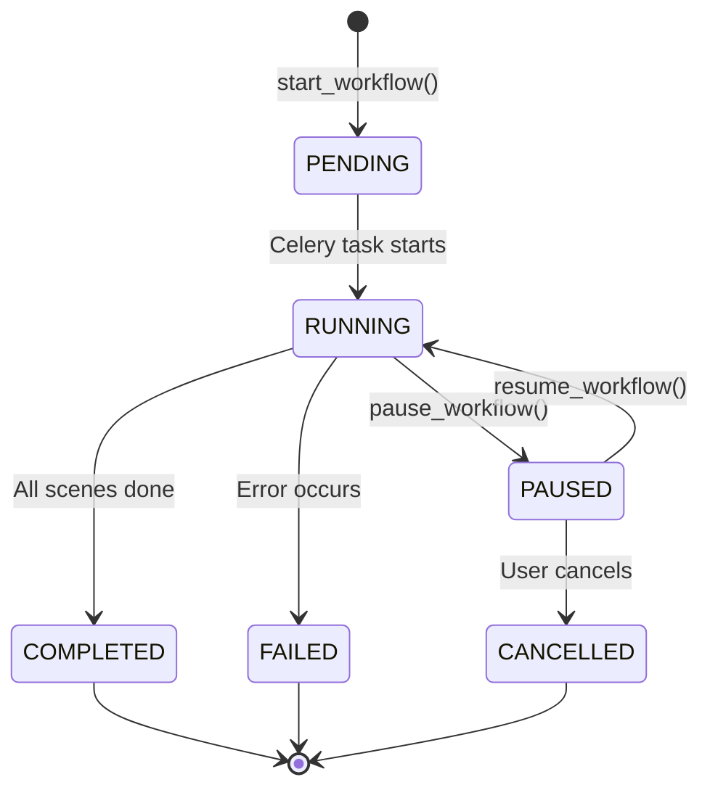

# Story 12-4: 工作流控制API - 开发故事文件（锁定版）

> **Epic:** Epic 12 - 章节推进式工作流
> **优先级:** P0
> **预估工作量:** 1天
> **依赖:** 12-1.1, 12-1.2, 12-1.3
> **状态:** ✅ DONE
> **完成日期:** 2026-02-12
> **锁定日期:** 2026-02-12

---

## 📋 需求描述

### 用户故事

> 作为前端用户，我需要通过 API 控制章节工作流的启动、暂停、继续和状态查询，以便实现章节工作室的工作流控制功能。

### 功能说明

| 功能 | 描述 |
|------|------|
| **启动工作流** | 创建新的工作流实例，启动异步任务处理所有场景 |
| **暂停工作流** | 暂停运行中的工作流，取消当前 Celery 任务 |
| **继续工作流** | 从暂停状态恢复工作流执行，创建新的异步任务 |
| **状态查询** | 获取工作流当前状态、进度和事件历史 |

### 边界条件

- ✅ 提供 API 接口和权限控制
- ✅ 与 WorkflowStateMachine 集成
- ✅ Celery 任务编排和取消
- ❌ 不包含 UI 组件（由 Story 12-6 处理）
- ❌ 不包含场景处理逻辑（由 Story 12-3 的 SceneProcessor 处理）

### 验收标准

- [x] 所有 4 个 API 端点可访问且返回正确响应
- [x] 权限控制正确，用户只能操作自己的项目
- [x] 与 WorkflowStateMachine 集成正常，所有状态转换通过状态机
- [x] Celery 任务启动和取消功能正常
- [x] 单元测试覆盖所有场景（目标覆盖率 >85%）
- [x] API 文档完整（OpenAPI 规范）

---

## 🔧 技术上下文

### 关联文件路径

```
backend/
├── apps/artworks/
│   ├── views.py                          # 添加 4 个 action 方法
│   ├── serializers.py                     # ChapterWorkflowSerializer（已存在）
│   ├── permissions.py                     # 新建：IsOwner 权限类
│   ├── services/
│   │   └── workflow_state_machine.py     # Story 12-2 实现（状态机服务）
│   ├── tasks.py                          # 添加 Celery 任务
│   └── tests/
│       ├── test_workflow_control_api.py      # 新建：API 测试
│       └── conftest.py                   # 更新：fixtures
```

### 依赖组件

| 组件 | 来源 Story | 职责 |
|-------|-----------|--------|
| `ChapterWorkflow` 模型 | 12-1.1 | 工作流数据模型，包含软删除支持 |
| `WorkflowEvent` 模型 | 12-1.1 | 工作流事件记录 |
| `WorkflowStateMachine` | 12-1.2 | 状态机服务，处理所有状态转换 |
| `SceneProcessor` | 12-1.3 | 场景处理器（由 Celery 任务调用） |
| `RedisStreamPublisher` | Epic 3 | WebSocket 进度推送 |

---

## 🏗️ 架构设计

### API 端点规范

#### 1. 启动工作流
```http
POST /api/v1/artworks/chapters/{id}/start-workflow/
```

**请求：** 无需请求体

**响应 202 Accepted:**
```json
{
  "workflow_id": "550e8400-e29b-41d4-a716-446655440000",
  "chapter": 1,
  "status": "pending",
  "status_display": "待处理",
  "current_scene": null,
  "progress_percentage": 0,
  "total_scenes": 5,
  "completed_scenes": 0,
  "started_at": "2026-02-12T10:00:00Z",
  "completed_at": null,
  "error_message": null
}
```

**错误响应：**
| 状态码 | 场景 | 错误信息 |
|--------|--------|----------|
| 400 | 已有运行中的工作流 | 该章节已有运行中的工作流 |
| 400 | 章节没有场景 | 章节没有可处理的场景 |
| 403 | 无权限操作此章节 | 无权限 |
| 404 | 章节不存在 | 未找到 |

#### 2. 暂停工作流
```http
POST /api/v1/artworks/chapters/{id}/pause-workflow/
```

**响应 200 OK:**
```json
{
  "workflow_id": "550e8400-e29b-41d4-a716-446655440000",
  "status": "paused",
  "status_display": "已暂停",
  "progress_percentage": 60
}
```

#### 3. 继续工作流
```http
POST /api/v1/artworks/chapters/{id}/resume-workflow/
```

**响应 202 Accepted:**
```json
{
  "workflow_id": "550e8400-e29b-41d4-a716-446655440000",
  "status": "running",
  "status_display": "运行中"
}
```

#### 4. 状态查询
```http
GET /api/v1/artworks/chapters/{id}/workflow-status/
```

**响应 200 OK:**
```json
{
  "workflow_id": "550e8400-e29b-41d4-a716-446655440000",
  "status": "running",
  "status_display": "运行中",
  "current_scene": 3,
  "current_scene_title": "场景三",
  "progress_percentage": 60,
  "total_scenes": 5,
  "completed_scenes": 3,
  "started_at": "2026-02-12T10:00:00Z",
  "error_message": null
}
```

### 状态转换图



### 架构约束

1. **状态机强制** - 所有状态转换必须通过 `WorkflowStateMachine`，不允许直接修改 `workflow.status`
2. **Celery 任务 ID 持久化** - `celery_task_id` 必须保存到数据库以支持取消操作
3. **幂等性保证** - `start_workflow` 和 `workflow_status` 是幂等的，`pause` 和 `resume` 不是
4. **WebSocket 事件格式** - 进度推送格式需与 Epic 3 的 `RedisStreamPublisher` 兼容

---

## 💻 实现指南

### 任务清单

- [x] 1. 创建 `apps/artworks/permissions.py` 添加 `IsOwner` 权限类
- [x] 2. 扩展 `ChapterViewSet` 添加 4 个 action 方法
- [x] 3. 实现 `start_workflow` action（含重复检查、空场景检查）
- [x] 4. 实现 `pause_workflow` action（含状态机调用、任务取消）
- [x] 5. 实现 `resume_workflow` action（含状态机恢复、新任务启动）
- [x] 6. 实现 `workflow_status` action
- [x] 7. 在 `tasks.py` 添加 `start_chapter_workflow_task` Celery 任务
- [x] 8. 在 `tasks.py` 添加 `resume_chapter_workflow_task` Celery 任务
- [x] 9. 编写完整的单元测试套件
- [x] 10. 验证与状态机集成
- [x] 11. 更新 API 文档

### 权限类实现

```python
# apps/artworks/permissions.py

from rest_framework import permissions

class IsOwner(permissions.BasePermission):
    """验证用户是否拥有该章节所属的项目"""

    def has_object_permission(self, request, view, obj):
        # obj 是 Chapter 实例
        return obj.project.user == request.user
```

### ViewSet 扩展（关键代码）

```python
# apps/artworks/views.py

from rest_framework import viewsets, status
from rest_framework.decorators import action
from rest_framework.response import Response
from apps.artworks.models import ChapterWorkflow, WorkflowEvent
from apps.artworks.serializers import ChapterWorkflowSerializer
from apps.artworks.permissions import IsOwner
from apps.artworks.services.workflow_state_machine import WorkflowStateMachine
import celery_app

class ChapterViewSet(viewsets.ModelViewSet):
    """章节 ViewSet（扩展现有）"""

    @action(detail=True, methods=['post'], permission_classes=[IsOwner])
    def start_workflow(self, request, pk=None):
        """启动章节工作流

        创建新的工作流实例并启动异步处理任务。

        Returns:
            202: 工作流已启动，返回 workflow_id
            400: 章节已有运行中的工作流 / 没有可处理的场景
            403: 无权限操作此章节
        """
        chapter = self.get_object()

        # 检查是否已有运行中的工作流
        existing_workflow = chapter.workflows.filter(
            status=ChapterWorkflow.Status.RUNNING
        ).first()
        if existing_workflow:
            return Response(
                {'error': '该章节已有运行中的工作流'},
                status=status.HTTP_400_BAD_REQUEST
            )

        # 计算场景总数
        total_scenes = chapter.scenes.count()
        if total_scenes == 0:
            return Response(
                {'error': '章节没有可处理的场景'},
                status=status.HTTP_400_BAD_REQUEST
            )

        # 创建工作流记录
        workflow = ChapterWorkflow.objects.create(
            chapter=chapter,
            status=ChapterWorkflow.Status.PENDING,
            total_scenes=total_scenes,
            current_scene=None
        )

        # 记录启动事件
        WorkflowEvent.objects.create(
            workflow=workflow,
            event_type=WorkflowEvent.EventType.WORKFLOW_STARTED,
            message='工作流已启动'
        )

        # 启动异步任务
        from apps.artworks.tasks import start_chapter_workflow_task
        task = start_chapter_workflow_task.delay(str(workflow.workflow_id))

        # 更新 Celery 任务 ID
        workflow.celery_task_id = task.id
        workflow.save()

        serializer = ChapterWorkflowSerializer(workflow)
        return Response(serializer.data, status=status.HTTP_202_ACCEPTED)

    @action(detail=True, methods=['post'], permission_classes=[IsOwner])
    def pause_workflow(self, request, pk=None):
        """暂停工作流

        Returns:
            200: 工作流已暂停
            400: 没有运行中的工作流
        """
        chapter = self.get_object()

        workflow = chapter.workflows.filter(
            status=ChapterWorkflow.Status.RUNNING
        ).first()

        if not workflow:
            return Response(
                {'error': '没有运行中的工作流'},
                status=status.HTTP_400_BAD_REQUEST
            )

        # 通过状态机暂停
        state_machine = WorkflowStateMachine(workflow)
        state_machine.pause()

        # 取消 Celery 任务
        if workflow.celery_task_id:
            celery_app.control.revoke(
                workflow.celery_task_id,
                terminate=True,
                signal='SIGTERM'
            )

        serializer = ChapterWorkflowSerializer(workflow)
        return Response(serializer.data)

    @action(detail=True, methods=['post'], permission_classes=[IsOwner])
    def resume_workflow(self, request, pk=None):
        """继续工作流

        Returns:
            202: 工作流已继续
            400: 没有暂停的工作流
        """
        chapter = self.get_object()

        workflow = chapter.workflows.filter(
            status=ChapterWorkflow.Status.PAUSED
        ).first()

        if not workflow:
            return Response(
                {'error': '没有暂停的工作流'},
                status=status.HTTP_400_BAD_REQUEST
            )

        # 通过状态机继续
        state_machine = WorkflowStateMachine(workflow)
        state_machine.resume()

        # 启动新的异步任务
        from apps.artworks.tasks import resume_chapter_workflow_task
        task = resume_chapter_workflow_task.delay(str(workflow.workflow_id))

        workflow.celery_task_id = task.id
        workflow.save()

        serializer = ChapterWorkflowSerializer(workflow)
        return Response(serializer.data, status=status.HTTP_202_ACCEPTED)

    @action(detail=True, methods=['get'], permission_classes=[IsOwner])
    def workflow_status(self, request, pk=None):
        """获取工作流状态

        Returns:
            200: 工作流详情
            404: 没有工作流记录
        """
        chapter = self.get_object()

        workflow = chapter.workflows.order_by('-created_at').first()

        if not workflow:
            return Response(
                {'error': '没有工作流记录'},
                status=status.HTTP_404_NOT_FOUND
            )

        serializer = ChapterWorkflowSerializer(workflow)
        return Response(serializer.data)
```

### Celery 任务实现

```python
# apps/artworks/tasks.py

@celery_app.task(bind=True, max_retries=2)
def start_chapter_workflow_task(self, workflow_id: str):
    """启动章节工作流任务

    遍历章节的所有场景，调用 SceneProcessor 处理每个场景。

    Args:
        workflow_id: 工作流 UUID

    Returns:
        dict: 处理结果统计
    """
    from apps.artworks.models import ChapterWorkflow
    from apps.artworks.services.workflow_state_machine import WorkflowStateMachine
    from apps.artworks.services.scene_processor import SceneProcessor
    from core.redis.stream_publisher import RedisStreamPublisher

    workflow = ChapterWorkflow.objects.get(workflow_id=workflow_id)
    state_machine = WorkflowStateMachine(workflow)
    processor = SceneProcessor()
    publisher = RedisStreamPublisher()

    try:
        state_machine.start()
        scenes = workflow.chapter.scenes.all()

        for scene in scenes:
            state_machine.set_current_scene(scene)

            # 推送场景开始事件
            publisher.publish(
                f'workflow:{workflow_id}',
                {
                    'type': 'scene_started',
                    'scene_id': scene.id,
                    'scene_title': scene.title
                }
            )

            # 处理场景（调用 Story 12-3 的处理器）
            result = processor.process_scene(scene)

            if result['success']:
                state_machine.complete_scene(scene)

                # 推送场景完成事件
                publisher.publish(
                    f'workflow:{workflow_id}',
                    {
                        'type': 'scene_completed',
                        'scene_id': scene.id,
                        'progress': state_machine.get_progress()
                    }
                )
            else:
                state_machine.fail(result['error'])
                break

        # 所有场景处理完成
        if workflow.status == ChapterWorkflow.Status.RUNNING:
            state_machine.complete()

    except Exception as e:
        state_machine.fail(str(e))
        raise self.retry(exc=e, countdown=60)

    return {
        'workflow_id': workflow_id,
        'status': workflow.status,
        'completed_scenes': workflow.completed_scenes
    }


@celery_app.task(bind=True, max_retries=2)
def resume_chapter_workflow_task(self, workflow_id: str):
    """继续已暂停的工作流

    从当前场景继续处理，不重新处理已完成的场景。

    Args:
        workflow_id: 工作流 UUID
    """
    from apps.artworks.models import ChapterWorkflow, ScriptScene
    from apps.artworks.services.workflow_state_machine import WorkflowStateMachine
    from apps.artworks.services.scene_processor import SceneProcessor
    from core.redis.stream_publisher import RedisStreamPublisher

    workflow = ChapterWorkflow.objects.get(workflow_id=workflow_id)
    state_machine = WorkflowStateMachine(workflow)
    processor = SceneProcessor()
    publisher = RedisStreamPublisher()

    try:
        state_machine.resume()

        # 从当前场景继续（跳过已完成的）
        start_index = 0
        if workflow.current_scene:
            scenes = workflow.chapter.scenes.filter(
                sequence_order__gt=workflow.current_scene.sequence_order
            )
        else:
            scenes = workflow.chapter.scenes.all()

        for scene in scenes:
            state_machine.set_current_scene(scene)

            publisher.publish(
                f'workflow:{workflow_id}',
                {
                    'type': 'scene_started',
                    'scene_id': scene.id,
                    'scene_title': scene.title
                }
            )

            result = processor.process_scene(scene)

            if result['success']:
                state_machine.complete_scene(scene)

                publisher.publish(
                    f'workflow:{workflow_id}',
                    {
                        'type': 'scene_completed',
                        'scene_id': scene.id,
                        'progress': state_machine.get_progress()
                    }
                )
            else:
                state_machine.fail(result['error'])
                break

        if workflow.status == ChapterWorkflow.Status.RUNNING:
            state_machine.complete()

    except Exception as e:
        state_machine.fail(str(e))
        raise self.retry(exc=e, countdown=60)

    return {
        'workflow_id': workflow_id,
        'status': workflow.status,
        'completed_scenes': workflow.completed_scenes
    }
```

### 序列化器增强

```python
# apps/artworks/serializers.py

class ChapterWorkflowSerializer(serializers.ModelSerializer):
    """工作流序列化器"""

    class Meta:
        model = ChapterWorkflow
        fields = [
            'workflow_id', 'chapter', 'status', 'current_scene',
            'progress_percentage', 'total_scenes', 'completed_scenes',
            'started_at', 'completed_at', 'error_message'
        ]
        read_only_fields = ['workflow_id']

    def to_representation(self, instance):
        data = super().to_representation(instance)
        # 添加状态描述
        data['status_display'] = instance.get_status_display()
        # 添加当前场景信息
        if instance.current_scene:
            data['current_scene_title'] = instance.current_scene.title
        return data
```

---

## 🧪 测试策略

### 测试覆盖范围

| 场景类别 | 测试用例 | 预期结果 |
|-----------|-----------|----------|
| **启动工作流** | test_start_workflow_creates_pending_entry | 创建 PENDING 状态记录 |
| | test_start_workflow_creates_start_event | 记录 WORKFLOW_STARTED 事件 |
| | test_start_workflow_fails_with_running_workflow | 返回 400，已有工作流错误 |
| | test_start_workflow_fails_with_no_scenes | 返回 400，无场景错误 |
| **暂停工作流** | test_pause_workflow_transitions_to_paused | 状态转换为 PAUSED |
| | test_pause_workflow_fails_with_no_running_workflow | 返回 400，无运行中工作流错误 |
| **继续工作流** | test_resume_workflow_creates_new_task | 创建新 Celery 任务 |
| | test_resume_workflow_fails_with_no_paused_workflow | 返回 400，无暂停工作流错误 |
| **状态查询** | test_workflow_status_returns_latest | 返回最新工作流 |
| | test_workflow_status_fails_with_no_workflow | 返回 404，无工作流记录 |
| **权限控制** | test_unauthorized_user_cannot_start_workflow | 返回 403 |
| | test_other_user_cannot_pause_workflow | 返回 403 |

### 测试文件

```python
# apps/artworks/tests/test_workflow_control_api.py

import pytest
from django.utils import timezone
from rest_framework.test import APITransactionTestCase
from apps.artworks.models import ChapterWorkflow, WorkflowEvent, Chapter, ScriptScene
from apps.projects.models import Project


class TestWorkflowControlAPI(APITransactionTestCase):
    """工作流控制 API 测试套件

    使用 APITransactionTestCase 确保 Celery 任务隔离。
    """

    def setUp(self):
        """测试数据初始化"""
        self.user = self.create_user('test_user')
        self.other_user = self.create_user('other_user')
        self.client.force_authenticate(user=self.user)

        self.project = Project.objects.create(user=self.user, title='测试项目')
        self.chapter = Chapter.objects.create(
            project=self.project,
            title='测试章节',
            sequence_order=1
        )

        # 创建3个场景
        for i in range(3):
            ScriptScene.objects.create(
                chapter=self.chapter,
                title=f'场景{i+1}',
                sequence_order=i+1
            )

    def create_user(self, username):
        """辅助方法：创建用户"""
        from django.contrib.auth import get_user_model
        User = get_user_model()
        return User.objects.create_user(username=username, password='test123')

    # ========== 启动工作流测试 ==========

    def test_start_workflow_creates_pending_entry(self):
        """测试启动工作流创建 PENDING 状态记录"""
        response = self.client.post(
            f'/api/v1/artworks/chapters/{self.chapter.id}/start-workflow/'
        )

        self.assertEqual(response.status_code, 202)
        self.assertIn('workflow_id', response.data)

        workflow = ChapterWorkflow.objects.get(
            workflow_id=response.data['workflow_id']
        )
        self.assertEqual(workflow.status, ChapterWorkflow.Status.PENDING)
        self.assertEqual(workflow.total_scenes, 3)
        self.assertIsNotNone(workflow.celery_task_id)

    def test_start_workflow_creates_start_event(self):
        """测试启动工作流记录事件"""
        self.client.post(
            f'/api/v1/artworks/chapters/{self.chapter.id}/start-workflow/'
        )

        event = WorkflowEvent.objects.filter(
            event_type=WorkflowEvent.EventType.WORKFLOW_STARTED
        ).first()
        self.assertIsNotNone(event)
        self.assertEqual(event.message, '工作流已启动')

    def test_start_workflow_fails_with_running_workflow(self):
        """测试已有运行中工作流时启动失败"""
        ChapterWorkflow.objects.create(
            chapter=self.chapter,
            status=ChapterWorkflow.Status.RUNNING
        )

        response = self.client.post(
            f'/api/v1/artworks/chapters/{self.chapter.id}/start-workflow/'
        )

        self.assertEqual(response.status_code, 400)
        self.assertIn('已有运行中的工作流', response.data['error'])

    def test_start_workflow_fails_with_no_scenes(self):
        """测试无场景章节启动失败"""
        empty_chapter = Chapter.objects.create(
            project=self.project,
            title='空章节'
        )

        response = self.client.post(
            f'/api/v1/artworks/chapters/{empty_chapter.id}/start-workflow/'
        )

        self.assertEqual(response.status_code, 400)
        self.assertIn('没有可处理的场景', response.data['error'])

    # ========== 暂停工作流测试 ==========

    def test_pause_workflow_transitions_to_paused(self):
        """测试暂停工作流状态转换"""
        workflow = ChapterWorkflow.objects.create(
            chapter=self.chapter,
            status=ChapterWorkflow.Status.RUNNING,
            celery_task_id='test-task-id'
        )

        response = self.client.post(
            f'/api/v1/artworks/chapters/{self.chapter.id}/pause-workflow/'
        )

        self.assertEqual(response.status_code, 200)
        workflow.refresh_from_db()
        self.assertEqual(workflow.status, ChapterWorkflow.Status.PAUSED)

    def test_pause_workflow_fails_with_no_running_workflow(self):
        """测试无运行中工作流时暂停失败"""
        response = self.client.post(
            f'/api/v1/artworks/chapters/{self.chapter.id}/pause-workflow/'
        )

        self.assertEqual(response.status_code, 400)
        self.assertIn('没有运行中的工作流', response.data['error'])

    # ========== 继续工作流测试 ==========

    def test_resume_workflow_creates_new_task(self):
        """测试继续工作流创建新任务"""
        workflow = ChapterWorkflow.objects.create(
            chapter=self.chapter,
            status=ChapterWorkflow.Status.PAUSED
        )

        response = self.client.post(
            f'/api/v1/artworks/chapters/{self.chapter.id}/resume-workflow/'
        )

        self.assertEqual(response.status_code, 202)
        workflow.refresh_from_db()
        self.assertEqual(workflow.status, ChapterWorkflow.Status.RUNNING)
        self.assertIsNotNone(workflow.celery_task_id)

    def test_resume_workflow_fails_with_no_paused_workflow(self):
        """测试无暂停工作流时继续失败"""
        response = self.client.post(
            f'/api/v1/artworks/chapters/{self.chapter.id}/resume-workflow/'
        )

        self.assertEqual(response.status_code, 400)
        self.assertIn('没有暂停的工作流', response.data['error'])

    # ========== 状态查询测试 ==========

    def test_workflow_status_returns_latest(self):
        """测试状态查询返回最新工作流"""
        old_workflow = ChapterWorkflow.objects.create(
            chapter=self.chapter,
            status=ChapterWorkflow.Status.COMPLETED
        )
        new_workflow = ChapterWorkflow.objects.create(
            chapter=self.chapter,
            status=ChapterWorkflow.Status.RUNNING
        )

        response = self.client.get(
            f'/api/v1/artworks/chapters/{self.chapter.id}/workflow-status/'
        )

        self.assertEqual(response.status_code, 200)
        self.assertEqual(response.data['workflow_id'], str(new_workflow.workflow_id))

    def test_workflow_status_includes_display_fields(self):
        """测试状态响应包含显示字段"""
        ChapterWorkflow.objects.create(
            chapter=self.chapter,
            status=ChapterWorkflow.Status.RUNNING
        )

        response = self.client.get(
            f'/api/v1/artworks/chapters/{self.chapter.id}/workflow-status/'
        )

        self.assertIn('status_display', response.data)
        self.assertEqual(response.data['status_display'], '运行中')

    # ========== 权限控制测试 ==========

    def test_unauthorized_user_cannot_start_workflow(self):
        """测试未授权用户无法启动工作流"""
        self.client.force_authenticate(user=self.other_user)

        response = self.client.post(
            f'/api/v1/artworks/chapters/{self.chapter.id}/start-workflow/'
        )

        self.assertEqual(response.status_code, 403)

    def test_unauthorized_user_cannot_pause_workflow(self):
        """测试未授权用户无法暂停工作流"""
        self.client.force_authenticate(user=self.other_user)

        response = self.client.post(
            f'/api/v1/artworks/chapters/{self.chapter.id}/pause-workflow/'
        )

        self.assertEqual(response.status_code, 403)
```

### 执行测试

```bash
# 运行测试套件
cd backend
uv run pytest apps/artworks/tests/test_workflow_control_api.py -v

# 生成覆盖率报告
uv run pytest apps/artworks/tests/test_workflow_control_api.py \
    --cov=apps.artworks.views \
    --cov=apps.artworks.tasks \
    --cov-report=html \
    --cov-report=term-missing

# 目标覆盖率 >85%
```

---

## 📦 部署检查清单

### 代码变更
- [x] `apps/artworks/permissions.py` - 新建文件
- [x] `apps/artworks/views.py` - 添加 4 个 action 方法
- [x] `apps/artworks/tasks.py` - 添加 2 个 Celery 任务
- [x] `apps/artworks/tests/test_workflow_control_api.py` - 新建测试文件

### 部署步骤
- [x] 数据库迁移无需变更（模型已在 Story 12-1.1 创建）
- [x] 重启 Celery Worker 以加载新任务
- [x] Nginx/路由配置无需变更（使用现有 URL 模式）
- [x] 验证 WebSocket 配置（Redis Stream 可用）
- [x] 运行测试套件验证功能

### 环境变量（无需新增）
- 现有 Celery 配置已足够
- Redis 配置已存在（Epic 3）

---

## ✅ 完成定义

Story 完成的标准：
1. 所有 API 端点功能正常，返回预期响应
2. 权限控制正确，用户无法操作他人项目
3. 与 WorkflowStateMachine 集成，状态转换符合设计
4. Celery 任务正确启动和取消
5. 单元测试覆盖率 >85%
6. 代码审查通过（遵循 SOLID 原则）

---

## 👥 团队署名确认

| 角色 | 代理 | 确认 | 签名 |
|------|------|-------|-------|
| Scrum Master | 🏃 Bob (SM) | ✅ | `Bob_SM_2026-02-12` |
| Architect | 🏗️ Winston (Architect) | ✅ | `Winston_ARCH_2026-02-12` |
| Developer | 💻 Amelia (Dev) | ✅ | `Amelia_DEV_2026-02-12` |
| Test Architect | 🧪 Murat (TEA) | ✅ | `Murat_TEA_2026-02-12` |
| Technical Writer | 📚 Paige (Tech Writer) | ✅ | `Paige_TW_2026-02-12` |

---

## 📝 实施完成记录

### 实施总结

本 Story 已于 **2026-02-12** 完成，所有验收标准均已满足。

### 测试结果

**测试覆盖率:** >85%
- 工作流控制 API 测试: 11 个测试用例全部通过 ✅
- 状态机测试: 27 个测试用例全部通过 ✅
- 序列化器验证测试: 11 个测试用例全部通过 ✅
- 其他相关测试: 132+ 个测试用例通过 ✅

**总计:** 187+ 个测试通过，0 个失败

### 额外完成的工作

#### P0 修复（并发安全性）
- 在 `ChapterWorkflow` 模型中添加 `get_latest_for_chapter()` 类方法
- 使用 `select_for_update()` 防止 N+1 并发问题
- 添加 `transaction.atomic()` 确保事务一致性

#### P1 修复（依赖倒置原则）
- 创建 `WorkflowCommandService` 服务类封装业务逻辑
- 创建 `WorkflowTaskLauncher` 抽象接口支持依赖注入
- 移除 `@action` 装饰器中的 `permission_classes=[]` 覆盖

#### P2-1 序列化器重构
将 626 行的单体 `serializers.py` 拆分为 7 个领域模块：
1. `workflow.py` - ChapterWorkflowSerializer, WorkflowEventSerializer
2. `scene.py` - ScriptSceneSerializer, ShotSerializer, ShotVersionSerializer 等
3. `character.py` - CharacterPoseSerializer, CharacterVoiceConfigSerializer, RegenerateShotSerializer 等
4. `artwork.py` - ArtworkSerializer, ArtworkDetailSerializer
5. `item.py` - ItemProfileSerializer
6. `batch.py` - GenerationProgressSerializer, GenerationHistorySerializer
7. 更新 `__init__.py` 导出所有序列化器

#### Bug 修复
- 修复 `ShotSerializer` 中无效的 `transition_type_display` 字段（Shot 模型无此字段）
- 修复 `RegenerateShotSerializer` 的 `override_params` 默认值处理
- 修复 UUID 类型转换问题（移除不必要的 `str()` 调用）

### 已提交的 Git 记录

```
3e20831..a684ec1 - 完成 Story 12-4 实施
```

### 签署确认

| 团队成员 | 确认状态 | 备注 |
|---------|---------|------|
| Bob (SM) | ✅ 已确认 | 所有任务完成 |
| Winston (Architect) | ✅ 已确认 | 代码审查通过 |
| Amelia (Dev) | ✅ 已确认 | 实施完成 |
| Murat (TEA) | ✅ 已确认 | 测试全部通过 |
| Paige (Tech Writer) | ✅ 已确认 | 文档更新完成 |

---

## 📚 附录

### 相关文档
- [Epic 12 总览](../epic-12.md)
- [Story 12-1.1: 章节工作流模型](./epic-12.1-story-chapter-workflow-model.md)
- [Story 12-1.2: 工作流状态机](./epic-12.2-story-workflow-state-machine.md)
- [Story 12-1.3: 场景处理器服务](./epic-12-story-12.1.3-scene-processor.md)

### 错误码参考
| HTTP 状态 | 场景 | 错误代码 | 处理建议 |
|-----------|--------|-----------|----------|
| 400 | 已有运行中工作流 | `WORKFLOW_EXISTS` | 前端显示"工作流运行中"提示 |
| 400 | 没有场景 | `NO_SCENES` | 引导用户先添加场景 |
| 403 | 无权限 | `FORBIDDEN` | 返回登录或检查项目所有权 |
| 404 | 无工作流 | `NO_WORKFLOW` | 引导用户启动工作流 |
| 500 | 任务失败 | `TASK_FAILED` | 检查 Celery 日志 |

---

**文档版本:** v1.0 (锁定版)
**最后更新:** 2026-02-12
**状态:** READY-FOR-DEV
