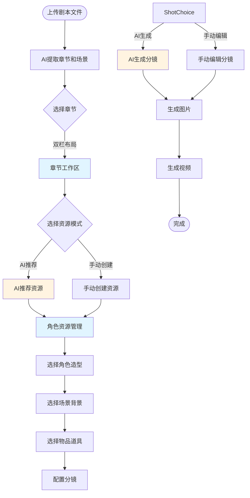

# Epic 11: 流程和UI优化 - 完整规划文档

> **创建日期:** 2026-02-06
> **状态:** 📋 规划中
> **版本:** v2.0 (基于 Party Mode 讨论)
> **预计工期:** 4周
> **Story数量:** 16个 (4个Sub-Epic)

---

## 📋 目录

- [概述](#概述)
- [业务价值](#业务价值)
- [用户工作流程](#用户工作流程)
- [Sub-Epic 11.1: 资源管理系统](#sub-epic-111-资源管理系统)
- [Sub-Epic 11.2: 层级式创作工作流](#sub-epic-112-层级式创作工作流)
- [Sub-Epic 11.3: 引擎监控与配置](#sub-epic-113-引擎监控与配置)
- [Sub-Epic 11.4: 可视化进度系统](#sub-epic-114-可视化进度系统)
- [实施计划](#实施计划)
- [成功标准](#成功标准)

---

## 概述

### 背景

当前AI Story系统已完成核心功能开发(Epic 1-9),并基于设计文档v3.0确定了漫剧生成的核心数据模型。但针对"漫剧(动态漫画)生成"这一特定场景,仍存在以下流程和UI方面的痛点:

**痛点识别 (来自Party Mode Round 1讨论):**

1. **资源管理分散**
   - 角色资产(立绘、服装、音色)分散在不同界面,缺少统一管理
   - 同一角色有多套服装(家庭装、宴会装、战斗装等),缺少切换机制
   - 场景背景和物理场景缺少复用机制
   - 物品道具管理缺失

2. **工作流不直观**
   - 缺少章节 → 场景 → 分镜的层级式导航
   - 多步骤操作缺少引导,用户容易迷失
   - AI生成和手动创建模式没有清晰区分

3. **UI操作体验差**
   - 单页面显示内容过多,信息密度过高
   - 缺少双栏布局(目录树 + 工作区)
   - 目录树行为不一致(部分自动折叠,部分手动)

4. **引擎状态不可见**
   - 本地引擎(Ollama/ComfyUI/Edge-TTS)状态无监控
   - Fallback机制不可见
   - 成本统计缺失

### 目标

Epic 11旨在通过以下改进提升用户体验和工作效率:

1. **建立统一的资源管理系统**
   - 整合角色、场景、物品资源于一体
   - 支持多套造型管理和智能推荐
   - 提供资源复用和配置界面

2. **实现层级式创作工作流**
   - 双栏布局:左侧目录树 + 右侧工作区
   - 章节 → 场景 → 分镜三级导航
   - AI生成模式与手动创建模式共存

3. **增强引擎可观测性**
   - 实时监控本地引擎状态
   - 可视化Fallback机制
   - 统计成本和性能指标

4. **提升进度可视化**
   - 章节推进式工作流UI
   - 实时进度条和状态标识
   - 友好的错误处理和重试

### 范围

**包含:**
- 资源管理系统 (角色/场景/物品)
- 层级式创作工作流 (双栏布局 + 目录树)
- 引擎监控与配置 (健康检查 + 成本统计)
- 可视化进度系统 (章节推进UI + 进度条)

**不包含:**
- 全新的AI模型集成 (由Epic 10负责)
- 视频编辑功能 (由Epic 13负责)
- 多用户协作功能 (由Epic 14负责)

---

## 业务价值

### 用户价值

| 价值维度 | 改进前 | 改进后 | 提升 |
|---------|--------|--------|------|
| **资源管理效率** | 分散查找资源,需5分钟/次 | 统一界面管理,30秒/次 | **10倍** |
| **工作流导航效率** | 多页面跳转,需10次点击/场景 | 目录树导航,2次点击/场景 | **5倍** |
| **AI生成模式** | 固定流程,不可选 | AI推荐 + 手动创建,灵活切换 | **灵活性↑** |
| **引擎故障排查** | 日志查找,需20分钟 | 实时状态监控,2分钟 | **10倍** |
| **工作流进度感知** | 刷新页面查看状态 | 实时进度推送 | **即时** |

### 技术价值

1. **数据模型完善**
   - CharacterPose模型支持多套造型
   - CharacterVoiceConfig模型支持音色配置
   - PhysicalScene模型支持场景模板复用
   - Prop模型支持物品道具管理

2. **前端组件复用**
   - DirectoryTree组件可复用于所有层级导航
   - ResourceCard组件可复用于角色/场景/物品展示
   - 进度条组件可复用于所有异步任务
   - 引擎监控组件可复用于运维面板

3. **API标准化**
   - RESTful API遵循OpenAPI规范
   - WebSocket事件统一命名约定
   - 错误码标准化

---

## 用户工作流程

### 完整工作流:从上传剧本到生成视频



### 双栏布局工作流

```
┌─────────────────────────────────────────────────────────────┐
│                      AI Story - 漫剧生成系统                  │
├─────────────────┬───────────────────────────────────────────┤
│                 │                                           │
│  📁 目录树       │           🔧 工作区                       │
│                 │                                           │
│  📖 作品        │  ┌─────────────────────────────────┐    │
│    ├─ 第1章    │  │                                 │    │
│    │  ├─ 场景1 │  │     [资源管理面板]               │    │
│    │  └─ 场景2 │  │                                 │    │
│    └─ 第2章    │  │  👤 角色: [Alice] [造型选择▼]    │    │
│       ├─ 场景3 │  │  🏷️  场景: [实验室] [选择背景▼]  │    │
│       └─ 场景4 │  │  📦 物品: [实验设备] [添加道具▼]  │    │
│                 │  │                                 │    │
│  🎭 资源库      │  │  [AI生成] [手动创建]            │    │
│    ├─ 角色     │  └─────────────────────────────────┘    │
│    ├─ 场景     │                                           │
│    └─ 物品     │  ┌─────────────────────────────────┐    │
│                 │  │                                 │    │
│  ⚙️ 引擎状态    │  │     [分镜编辑面板]               │    │
│    ✅ Ollama   │  │                                 │    │
│    ✅ ComfyUI  │  │  分镜1: Alice走进实验室           │    │
│    ⚠️ EdgeTTS  │  │  [图片预览] [编辑] [删除]        │    │
│                 │  │                                 │    │
│                 │  │  分镜2: 实验设备开始运行         │    │
│                 │  │  [图片预览] [编辑] [删除]        │    │
│                 │  │                                 │    │
│                 │  └─────────────────────────────────┘    │
└─────────────────┴───────────────────────────────────────────┘
```

---

## Sub-Epic 11.1: 资源管理系统

### 概述

建立统一的资源管理系统,整合角色、场景、物品资源,支持资源复用和智能推荐。

### 数据模型设计

#### 1. 角色造型管理 (CharacterPose)

```python
# apps/characters/models.py

class CharacterPose(models.Model):
    """角色造型 - 同一角色的多套服装"""
    character = models.ForeignKey(CharacterProfile, on_delete=models.CASCADE, related_name='poses')

    # 基本信息
    pose_name = models.CharField(max_length=200)  # "家庭装", "宴会装", "战斗装"
    pose_type = models.CharField(
        max_length=20,
        choices=[
            ('casual', '休闲装'),
            ('formal', '正装'),
            ('battle', '战斗装'),
            ('school', '校服'),
            ('custom', '自定义'),
        ],
        default='casual'
    )

    # 立绘图片
    pose_image = models.ImageField(upload_to='characters/poses/%Y/%m/')

    # 适用场景
    suitable_for_scenes = models.JSONField(default=list)  # ["家", "宴会", "战场"]

    # AI提取信息
    extraction_source = models.CharField(max_length=50, blank=True)  # "ai_generated", "manual_upload"
    extracted_from_chapter = models.IntegerField(null=True, blank=True)
    description = models.TextField(blank=True)

    # 使用统计
    usage_count = models.IntegerField(default=0)
    last_used_at = models.DateTimeField(auto_now=True)

    # 元数据
    created_at = models.DateTimeField(auto_now_add=True)
    is_active = models.BooleanField(default=True)

    class Meta:
        ordering = ['-usage_count', '-last_used_at']
        verbose_name = '角色造型'
        verbose_name_plural = '角色造型'
```

#### 2. 角色音色配置 (CharacterVoiceConfig)

```python
class CharacterVoiceConfig(models.Model):
    """角色音色配置"""
    character = models.OneToOneField(CharacterProfile, on_delete=models.CASCADE, related_name='voice_config')

    # TTS引擎
    tts_engine = models.CharField(
        max_length=20,
        choices=[
            ('edge', 'Edge-TTS (本地)'),
            ('elevenlabs', 'ElevenLabs (云端)'),
            ('baidu', '百度TTS'),
            ('azure', 'Azure TTS'),
        ],
        default='edge'
    )
    voice_id = models.CharField(max_length=100, blank=True)

    # 音色参数
    voice_type = models.CharField(max_length=100, blank=True)  # "zh-CN-XiaoxiaoNeural"
    pitch = models.CharField(max_length=20, default='normal')  # high/normal/low
    speed = models.CharField(max_length=20, default='normal')  # fast/normal/slow
    volume = models.CharField(max_length=20, default='normal')  # loud/normal/quiet

    # 情感配置
    emotion_mode = models.CharField(max_length=50, blank=True)
    emotion_voices = models.JSONField(default=dict)

    # 试听样本
    voice_sample_url = models.URLField(blank=True)
    sample_text = models.CharField(max_length=500, blank=True, default="你好,这是语音试听。")

    # 元数据
    created_at = models.DateTimeField(auto_now_add=True)
    updated_at = models.DateTimeField(auto_now=True)

    class Meta:
        verbose_name = '角色音色配置'
        verbose_name_plural = '角色音色配置'
```

#### 3. 物理场景模板 (PhysicalScene)

```python
# apps/scenes/models.py

class PhysicalScene(models.Model):
    """物理场景模板 - 可复用的环境类型"""
    category = models.CharField(
        max_length=50,
        choices=[
            ('indoor', '室内'),
            ('outdoor', '室外'),
            ('abstract', '抽象'),
        ],
        default='indoor'
    )

    name = models.CharField(max_length=200)  # "现代实验室", "古典书房"
    description = models.TextField(blank=True)

    # 默认属性
    default_lighting = models.CharField(max_length=50, blank=True)  # "bright", "dim", "neon"
    default_atmosphere = models.CharField(max_length=50, blank=True)  # "calm", "tense", "mysterious"

    # 背景图片
    background_image = models.ImageField(upload_to='physical_scenes/%Y/%m/', blank=True)

    # AI提示词模板
    prompt_template = models.TextField(blank=True)

    # 系统模板 vs 用户自定义
    is_system_template = models.BooleanField(default=False)

    # 使用统计
    usage_count = models.IntegerField(default=0)

    # 元数据
    created_at = models.DateTimeField(auto_now_add=True)
    is_active = models.BooleanField(default=True)

    class Meta:
        verbose_name = '物理场景模板'
        verbose_name_plural = '物理场景模板'
        ordering = ['-usage_count', '-is_system_template', 'name']
```

#### 4. 物品道具管理 (Prop)

```python
# apps/props/models.py

class Prop(models.Model):
    """物品道具"""
    artwork = models.ForeignKey(Artwork, on_delete=models.CASCADE, related_name='props')

    # 基本信息
    prop_name = models.CharField(max_length=200)
    prop_type = models.CharField(
        max_length=50,
        choices=[
            ('weapon', '武器'),
            ('tool', '工具'),
            ('accessory', '饰品'),
            ('furniture', '家具'),
            ('vehicle', '载具'),
            ('other', '其他'),
        ],
        default='other'
    )

    # 视觉素材
    prop_image = models.ImageField(upload_to='props/%Y/%m/', blank=True)

    # 描述
    description = models.TextField(blank=True)

    # 适用场景
    suitable_for_scenes = models.JSONField(default=list)

    # 使用统计
    usage_count = models.IntegerField(default=0)

    # 元数据
    created_at = models.DateTimeField(auto_now_add=True)
    is_active = models.BooleanField(default=True)

    class Meta:
        verbose_name = '物品道具'
        verbose_name_plural = '物品道具'
        ordering = ['-usage_count', 'prop_name']
```

---

### Story 11.1.1: 角色资源数据模型

**优先级:** P0 (核心功能)
**估算工作量:** 0.5天
**依赖:** 无

**用户故事:**
作为内容创作者,我希望为每个角色创建多套造型(如家庭装、宴会装、战斗装),并配置专属音色,以便在不同场景中使用合适的角色形象和声音。

**接受标准:**
- [ ] 创建 `CharacterPose` 模型
- [ ] 创建 `CharacterVoiceConfig` 模型
- [ ] 创建数据库迁移文件
- [ ] 编写单元测试 (至少10个测试用例)
- [ ] 通过 Ruff 代码质量检查 (100/100分)

**API设计:**
```python
# POST /api/v1/characters/{character_id}/poses/
{
    "pose_name": "宴会装",
    "pose_type": "formal",
    "pose_image": <Upload>,
    "suitable_for_scenes": ["宴会", "舞会"]
}

# POST /api/v1/characters/{character_id}/voice-config/
{
    "tts_engine": "edge",
    "voice_id": "zh-CN-XiaoxiaoNeural",
    "pitch": "normal",
    "speed": "normal"
}
```

---

### Story 11.1.2: 场景和物品数据模型

**优先级:** P0 (核心功能)
**估算工作量:** 0.5天
**依赖:** 无

**用户故事:**
作为内容创作者,我希望创建可复用的场景模板和物品道具,以便在不同章节中快速配置环境。

**接受标准:**
- [ ] 创建 `PhysicalScene` 模型
- [ ] 创建 `Prop` 模型
- [ ] 创建数据库迁移文件
- [ ] 编写单元测试 (至少10个测试用例)
- [ ] 通过 Ruff 代码质量检查

**API设计:**
```python
# POST /api/v1/artworks/{artwork_id}/physical-scenes/
{
    "name": "现代实验室",
    "category": "indoor",
    "default_lighting": "bright",
    "background_image": <Upload>
}

# POST /api/v1/artworks/{artwork_id}/props/
{
    "prop_name": "实验设备",
    "prop_type": "tool",
    "prop_image": <Upload>,
    "suitable_for_scenes": ["实验室", "研究设施"]
}
```

---

### Story 11.1.3: 资源管理前端界面

**优先级:** P1 (重要功能)
**估算工作量:** 2天
**依赖:** Story 11.1.1, Story 11.1.2

**用户故事:**
作为内容创作者,我希望在一个统一的界面中管理所有资源(角色、场景、物品),包括查看、添加、编辑、删除操作。

**接受标准:**
- [ ] 创建 `ResourceManagement.vue` 页面
- [ ] 创建 `CharacterCard.vue` 组件
- [ ] 创建 `SceneCard.vue` 组件
- [ ] 创建 `PropCard.vue` 组件
- [ ] 支持拖拽上传图片
- [ ] 支持在线试听音色
- [ ] 响应式设计

**UI设计要点:**
```vue
<template>
  <div class="resource-management">
    <!-- 资源类型选择 -->
    <div class="resource-tabs">
      <button @click="activeTab = 'characters'" :class="{ active: activeTab === 'characters' }">
        👤 角色
      </button>
      <button @click="activeTab = 'scenes'" :class="{ active: activeTab === 'scenes' }">
        🏷️ 场景
      </button>
      <button @click="activeTab = 'props'" :class="{ active: activeTab === 'props' }">
        📦 物品
      </button>
    </div>

    <!-- 资源列表 -->
    <div v-if="activeTab === 'characters'" class="resource-list">
      <CharacterCard
        v-for="character in characters"
        :key="character.id"
        :character="character"
        @edit="editCharacter"
        @delete="deleteCharacter"
      />
      <button @click="addCharacter" class="add-resource-btn">+ 添加角色</button>
    </div>
  </div>
</template>
```

---

### Story 11.1.4: AI推荐资源

**优先级:** P1 (重要功能)
**估算工作量:** 1.5天
**依赖:** Story 11.1.1, Story 11.1.2

**用户故事:**
作为内容创作者,我希望系统能根据场景描述智能推荐合适的角色造型、场景背景和物品道具,减少手动选择时间。

**接受标准:**
- [ ] 实现 `recommend_resources()` 服务方法
- [ ] 根据场景关键词匹配资源
- [ ] 优先推荐使用次数多的资源
- [ ] 支持手动覆盖推荐
- [ ] 编写单元测试

**技术实现:**
```python
# apps/characters/services.py

class CharacterPoseService:
    @staticmethod
    def recommend_poses(character_id: int, scene_name: str) -> List[CharacterPose]:
        """
        为角色推荐合适的造型

        Args:
            character_id: 角色ID
            scene_name: 场景名称

        Returns:
            推荐的造型列表 (按优先级排序)
        """
        character = CharacterProfile.objects.get(id=character_id)
        all_poses = character.poses.filter(is_active=True)

        # 1. 精确匹配场景
        exact_matches = all_poses.filter(
            suitable_for_scenes__contains=scene_name
        )

        if exact_matches.exists():
            return list(exact_matches.order_by('-usage_count'))

        # 2. 模糊匹配场景关键词
        scene_keywords = extract_keywords(scene_name)
        fuzzy_matches = []
        for pose in all_poses:
            for scene in pose.suitable_for_scenes:
                if any(kw in scene for kw in scene_keywords):
                    fuzzy_matches.append(pose)

        if fuzzy_matches:
            return sorted(list(set(fuzzy_matches)), key=lambda p: -p.usage_count)

        # 3. 默认返回第一个造型
        return [all_poses.first()] if all_poses.exists() else []
```

**API设计:**
```python
# GET /api/v1/characters/{character_id}/recommend-poses/?scene_name=宴会厅
[
    {
        "id": 1,
        "pose_name": "宴会装",
        "pose_type": "formal",
        "match_score": 1.0,
        "pose_image": "/media/characters/poses/2026/02/image.png"
    }
]
```

---

## Sub-Epic 11.2: 层级式创作工作流

### 概述

实现双栏布局的层级式创作工作流,左侧为目录树,右侧为工作区,支持章节 → 场景 → 分镜三级导航。

---

### Story 11.2.1: 双栏布局框架

**优先级:** P0 (核心功能)
**估算工作量:** 1.5天
**依赖:** 无

**用户故事:**
作为内容创作者,我希望在双栏布局中进行创作,左侧显示目录树,右侧显示工作区,以便快速导航和编辑。

**接受标准:**
- [ ] 创建 `DualPaneLayout.vue` 框架组件
- [ ] 左侧目录树固定宽度30%
- [ ] 右侧工作区自适应宽度70%
- [ ] 支持调整分栏宽度(拖拽分隔条)
- [ ] 响应式设计(移动端自动切换为单栏)

**UI设计要点:**
```vue
<template>
  <div class="dual-pane-layout">
    <!-- 左侧目录树 -->
    <div class="left-pane" :style="{ width: leftPaneWidth }">
      <DirectoryTree
        :data="treeData"
        @node-click="onNodeClick"
        @node-expand="onNodeExpand"
      />
    </div>

    <!-- 分隔条 -->
    <div class="resizer" @mousedown="startResize"></div>

    <!-- 右侧工作区 -->
    <div class="right-pane">
      <Workspace :node="selectedNode" />
    </div>
  </div>
</template>

<style scoped>
.dual-pane-layout {
  display: flex;
  height: 100vh;
}

.left-pane {
  min-width: 250px;
  max-width: 500px;
  background: #f5f5f5;
  border-right: 1px solid #ddd;
}

.right-pane {
  flex: 1;
  overflow: auto;
}

.resizer {
  width: 5px;
  cursor: col-resize;
  background: #e0e0e0;
}

.resizer:hover {
  background: #1890ff;
}
</style>
```

---

### Story 11.2.2: 目录树组件

**优先级:** P0 (核心功能)
**估算工作量:** 2天
**依赖:** Story 11.2.1

**用户故事:**
作为内容创作者,我希望在目录树中查看作品的层级结构(章节 → 场景 → 分镜),并通过点击节点快速导航到对应内容。

**接受标准:**
- [ ] 创建 `DirectoryTree.vue` 组件
- [ ] 支持多级嵌套结构
- [ ] 支持手动展开/折叠节点
- [ ] 显示节点图标和状态标识
- [ ] 支持节点搜索和过滤
- [ ] 支持右键菜单(添加/编辑/删除)

**数据结构:**
```javascript
// 扁平化结构,前端组装树
const treeData = [
  {
    id: 'chapter-1',
    type: 'chapter',
    label: '第1章: 纳米危机',
    children: [
      {
        id: 'scene-1',
        type: 'scene',
        label: '场景1: 纳米中心-日',
        children: [
          { id: 'shot-1', type: 'shot', label: '分镜1' },
          { id: 'shot-2', type: 'shot', label: '分镜2' }
        ]
      }
    ]
  }
]
```

**API设计:**
```python
# GET /api/v1/artworks/{artwork_id}/directory-tree/
{
    "data": [
        {
            "id": "chapter-1",
            "type": "chapter",
            "label": "第1章",
            "children": [...]
        }
    ]
}
```

---

### Story 11.2.3: 章节级别工作区

**优先级:** P1 (重要功能)
**估算工作量:** 1.5天
**依赖:** Story 11.2.1

**用户故事:**
作为内容创作者,我希望在章节工作区中查看章节概览、配置章节资源、启动AI生成流程。

**接受标准:**
- [ ] 创建 `ChapterWorkspace.vue` 组件
- [ ] 显示章节基本信息(标题、描述、场景数量)
- [ ] 显示章节资源(角色、场景、物品)
- [ ] 提供AI生成按钮(生成分镜、图片)
- [ ] 显示章节进度(已完成场景数/总场景数)

**UI设计要点:**
```vue
<template>
  <div class="chapter-workspace">
    <!-- 章节信息 -->
    <div class="chapter-header">
      <h2>{{ chapter.title }}</h2>
      <p>{{ chapter.description }}</p>
      <div class="chapter-stats">
        <span>场景数: {{ chapter.scenes.length }}</span>
        <span>进度: {{ completedScenes }}/{{ totalScenes }}</span>
      </div>
    </div>

    <!-- 资源配置 -->
    <div class="resource-config">
      <h3>资源配置</h3>
      <ResourceSelector
        type="character"
        :items="characters"
        v-model="selectedCharacters"
      />
      <ResourceSelector
        type="scene"
        :items="scenes"
        v-model="selectedScenes"
      />
      <ResourceSelector
        type="prop"
        :items="props"
        v-model="selectedProps"
      />
    </div>

    <!-- AI生成 -->
    <div class="ai-generation">
      <h3>AI生成</h3>
      <button @click="startAIGeneration">开始AI生成</button>
    </div>
  </div>
</template>
```

---

### Story 11.2.4: 场景级别工作区

**优先级:** P1 (重要功能)
**估算工作量:** 1.5天
**依赖:** Story 11.2.1

**用户故事:**
作为内容创作者,我希望在场景工作区中配置场景资源、编辑分镜列表、预览生成结果。

**接受标准:**
- [ ] 创建 `SceneWorkspace.vue` 组件
- [ ] 显示场景基本信息(名称、描述、分镜数量)
- [ ] 显示分镜列表(缩略图、编号、时长)
- [ ] 支持拖拽排序分镜
- [ ] 支持编辑分镜内容

---

### Story 11.2.5: 分镜级别工作区

**优先级:** P1 (重要功能)
**估算工作量:** 2天
**依赖:** Story 11.2.1

**用户故事:**
作为内容创作者,我希望在分镜工作区中详细编辑单个分镜,包括画面描述、角色、场景、运镜等。

**接受标准:**
- [ ] 创建 `ShotWorkspace.vue` 组件
- [ ] 显示分镜图片预览
- [ ] 编辑画面描述和提示词
- [ ] 选择角色和造型
- [ ] 选择场景背景
- [ ] 配置运镜参数
- [ ] 重新生成按钮

---

### Story 11.2.6: AI生成与手动创建切换

**优先级:** P2 (增强功能)
**估算工作量:** 1天
**依赖:** Story 11.2.3, Story 11.2.4, Story 11.2.5

**用户故事:**
作为内容创作者,我希望在AI生成和手动创建两种模式间灵活切换,既可以使用AI快速生成内容,也可以手动精细调整。

**接受标准:**
- [ ] 在每个工作区添加模式切换开关
- [ ] AI生成模式:显示推荐结果,支持一键应用
- [ ] 手动创建模式:显示表单,支持自由编辑
- [ ] 保存用户偏好设置

**UI设计要点:**
```vue
<template>
  <div class="workspace">
    <!-- 模式切换 -->
    <div class="mode-switch">
      <label>
        <input type="radio" value="ai" v-model="mode" />
        🤖 AI推荐
      </label>
      <label>
        <input type="radio" value="manual" v-model="mode" />
        ✋ 手动创建
      </label>
    </div>

    <!-- AI模式 -->
    <div v-if="mode === 'ai'" class="ai-mode">
      <AIRecommendations
        :recommendations="aiRecommendations"
        @apply="applyRecommendation"
      />
    </div>

    <!-- 手动模式 -->
    <div v-else class="manual-mode">
      <ManualForm
        :data="formData"
        @save="saveManualData"
      />
    </div>
  </div>
</template>
```

---

## Sub-Epic 11.3: 引擎监控与配置

### 概述

增强本地引擎(Ollama/ComfyUI/Edge-TTS)的可观测性,提供实时状态监控、健康检查、成本统计等功能。

---

### Story 11.3.1: EngineConfig数据模型

**优先级:** P0 (核心功能)
**估算工作量:** 0.5天
**依赖:** 无

**用户故事:**
作为开发者,我希望集中管理所有AI引擎的配置(主引擎、备份引擎、参数),以便快速切换和调整。

**接受标准:**
- [ ] 创建 `EngineConfig` 模型
- [ ] 支持主引擎和备份引擎配置
- [ ] 创建数据库迁移文件
- [ ] 编写单元测试
- [ ] 通过 Ruff 代码质量检查

**数据模型:**
```python
class EngineConfig(models.Model):
    """引擎配置"""
    engine_type = models.CharField(
        max_length=10,
        choices=[
            ('llm', 'LLM引擎'),
            ('image', '图像生成引擎'),
            ('tts', '语音合成引擎'),
        ]
    )

    # 主引擎
    primary_provider = models.CharField(max_length=50)
    primary_config = models.JSONField(default=dict)

    # 备份引擎
    fallback_provider = models.CharField(max_length=50, blank=True)
    fallback_config = models.JSONField(default=dict, blank=True)

    # 状态
    is_active = models.BooleanField(default=True)
    health_status = models.CharField(
        max_length=20,
        choices=[
            ('unknown', '未知'),
            ('healthy', '健康'),
            ('degraded', '降级'),
            ('down', '宕机'),
        ],
        default='unknown'
    )
    last_check = models.DateTimeField(auto_now=True)

    # 统计
    total_requests = models.IntegerField(default=0)
    success_count = models.IntegerField(default=0)
    failure_count = models.IntegerField(default=0)
    avg_response_time = models.FloatField(default=0.0)
```

---

### Story 11.3.2: 引擎健康检查

**优先级:** P0 (核心功能)
**估算工作量:** 1天
**依赖:** Story 11.3.1

**用户故事:**
作为运维人员,我希望系统自动检查所有引擎的健康状态,并在引擎故障时自动切换到备份引擎。

**接受标准:**
- [ ] 实现 `check_engine_health()` Celery Beat定时任务
- [ ] 每5分钟检查一次所有活跃引擎
- [ ] 检查项目:连接测试、功能测试、性能测试
- [ ] 更新 `health_status` 字段
- [ ] 发送告警通知

**技术实现:**
```python
@periodic_task(run_every=300.0)  # 每5分钟
def check_all_engines_health():
    """检查所有引擎的健康状态"""
    from apps.engines.models import EngineConfig
    from apps.engines.services import EngineHealthChecker

    engines = EngineConfig.objects.filter(is_active=True)

    for engine in engines:
        checker = EngineHealthChecker(engine)
        result = checker.check()

        # 更新健康状态
        if result['is_healthy']:
            engine.success_count += 1
            engine.consecutive_failures = 0

            if engine.consecutive_successes >= 3:
                engine.health_status = 'healthy'
        else:
            engine.failure_count += 1
            engine.consecutive_failures += 1

            if engine.consecutive_failures >= 10:
                engine.health_status = 'down'
            elif engine.consecutive_failures >= 3:
                engine.health_status = 'degraded'

        engine.avg_response_time = result['response_time_ms']
        engine.save()

        # 发送告警
        if engine.health_status == 'down':
            send_engine_alert(engine, result['error'])
```

---

### Story 11.3.3: 引擎监控面板

**优先级:** P1 (重要功能)
**估算工作量:** 2天
**依赖:** Story 11.3.1, Story 11.3.2

**用户故事:**
作为运维人员,我希望在可视化面板中查看所有引擎的实时状态、性能指标、成本统计。

**接受标准:**
- [ ] 创建 `EngineMonitoring.vue` 页面
- [ ] 显示所有引擎的健康状态(颜色标识:绿/黄/红)
- [ ] 显示性能指标(响应时间、成功率)
- [ ] 支持实时刷新(WebSocket)
- [ ] 支持手动触发健康检查

---

### Story 11.3.4: Fallback机制可视化

**优先级:** P2 (增强功能)
**估算工作量:** 1天
**依赖:** Story 11.3.1

**用户故事:**
作为开发者,我希望可视化查看Fallback机制的触发历史和效果。

**接受标准:**
- [ ] 创建 `FallbackLog` 模型
- [ ] 创建 `FallbackVisualization.vue` 组件
- [ ] 显示Fallback触发次数、原因、时间
- [ ] 提供Fallback统计图表

---

## Sub-Epic 11.4: 可视化进度系统

### 概述

提升工作流进度的可视化,实现章节推进式UI、实时进度条、友好错误处理等功能。

---

### Story 11.4.1: 章节推进式工作流UI

**优先级:** P0 (核心功能)
**估算工作量:** 2天
**依赖:** 无

**用户故事:**
作为内容创作者,我希望在章节视图中清晰看到每个场景的处理状态,以便管理工作流进度。

**接受标准:**
- [ ] 创建 `ChapterWorkflowView.vue` 页面
- [ ] 显示章节列表(垂直时间轴)
- [ ] 每个章节显示完成进度
- [ ] 点击章节展开场景列表
- [ ] 实时更新进度(WebSocket)

---

### Story 11.4.2: 实时进度条组件

**优先级:** P0 (核心功能)
**估算工作量:** 1天
**依赖:** 无

**用户故事:**
作为内容创作者,我希望在处理分镜时看到实时的进度条,包括当前阶段、完成百分比、剩余时间。

**接受标准:**
- [ ] 创建 `ProgressBar.vue` 可复用组件
- [ ] 显示当前执行阶段名称
- [ ] 显示完成百分比(0-100%)
- [ ] 显示剩余时间估算
- [ ] 支持取消操作

---

### Story 11.4.3: 友好的错误处理和重试

**优先级:** P1 (重要功能)
**估算工作量:** 1.5天
**依赖:** Story 11.4.2

**用户故事:**
作为内容创作者,我希望在任务失败时看到清晰的错误信息和建议的解决方案。

**接受标准:**
- [ ] 创建 `ErrorHandler` 服务类
- [ ] 捕获所有常见错误类型
- [ ] 为每种错误提供友好描述和解决方案
- [ ] 支持自动重试(指数退避)
- [ ] 支持手动重试

**技术实现:**
```python
class ErrorHandler:
    """统一错误处理器"""

    ERROR_TEMPLATES = {
        'api_timeout': {
            'title': 'API请求超时',
            'description': '连接AI引擎超时,请检查网络连接或引擎状态。',
            'solutions': [
                '检查本地引擎是否运行',
                '检查网络连接',
                '增加超时时间设置',
                '尝试切换到备用引擎'
            ],
            'can_retry': True
        },
        'api_quota_exceeded': {
            'title': 'API配额用尽',
            'description': '云端API配额已用完。',
            'solutions': [
                '升级API套餐',
                '切换到本地引擎',
                '等待配额重置'
            ],
            'can_retry': False
        }
    }

    @classmethod
    def handle_error(cls, error: Exception) -> dict:
        """处理错误并返回友好信息"""
        error_type = cls._classify_error(error)
        template = cls.ERROR_TEMPLATES.get(error_type, cls._get_default_template())

        return {
            'error_type': error_type,
            'title': template['title'],
            'description': template['description'],
            'solutions': template['solutions'],
            'can_retry': template['can_retry']
        }
```

---

### Story 11.4.4: WebSocket实时推送优化

**优先级:** P1 (重要功能)
**估算工作量:** 1天
**依赖:** Story 11.4.1, Story 11.4.2

**用户故事:**
作为内容创作者,我希望在浏览器中实时收到任务进度的更新,无需手动刷新页面。

**接受标准:**
- [ ] 创建 `ProgressConsumer` (Channels)
- [ ] 支持按项目ID订阅进度
- [ ] 推送事件类型:task_started/task_progress/task_completed/task_failed
- [ ] 支持断线重连(最多5次)
- [ ] 编写前端 `useWebSocket` Composable

**技术实现:**
```python
class ProgressConsumer(AsyncWebsocketConsumer):
    """进度推送Consumer"""

    async def connect(self):
        self.project_id = self.scope['url_route']['kwargs']['project_id']
        self.group_name = f'project_{self.project_id}'

        await self.channel_layer.group_add(
            self.group_name,
            self.channel_name
        )

        await self.accept()

    async def task_progress(self, event):
        """接收进度更新"""
        await self.send(text_data=json.dumps({
            'type': 'task_progress',
            'task_id': event['task_id'],
            'stage': event['stage'],
            'progress': event['progress'],
            'message': event['message']
        }))
```

---

## 实施计划

### 时间线

| 周次 | Sub-Epic | Stories | 工作量 | 交付物 |
|------|----------|---------|--------|--------|
| **Week 1** | 11.1 资源管理 | 11.1.1, 11.1.2, 11.1.3, 11.1.4 | 4.5天 | 数据模型 + 前端界面 + AI推荐 |
| **Week 2** | 11.2 层级式工作流 | 11.2.1, 11.2.2, 11.2.3, 11.2.4, 11.2.5 | 8.5天 | 双栏布局 + 目录树 + 工作区 |
| **Week 3** | 11.3 引擎监控 | 11.3.1, 11.3.2, 11.3.3, 11.3.4 | 4.5天 | 引擎配置 + 健康检查 + 监控面板 |
| **Week 4** | 11.4 可视化进度 | 11.4.1, 11.4.2, 11.4.3, 11.4.4 | 5.5天 | 章节UI + 进度条 + 错误处理 + WebSocket |

**总工期:** 4周 (23个工作日)

### 里程碑

| 里程碑 | 日期 | 交付物 | 验收标准 |
|--------|------|--------|----------|
| **M1: 资源管理完成** | Week 1结束 | - CharacterPose/CharacterVoiceConfig/PhysicalScene/Prop模型<br>- 资源管理前端界面<br>- AI推荐功能 | - 4个Story全部完成<br>- 单元测试覆盖率>80% |
| **M2: 层级式工作流完成** | Week 2结束 | - 双栏布局框架<br>- 目录树组件<br>- 章节/场景/分镜工作区 | - 5个Story全部完成<br>- UI/UX测试通过 |
| **M3: 引擎监控完成** | Week 3结束 | - EngineConfig模型<br>- 健康检查任务<br>- 监控面板 | - 4个Story全部完成<br>- 监控数据准确 |
| **M4: 进度可视化完成** | Week 4结束 | - 章节推进式UI<br>- 实时进度条<br>- 错误处理<br>- WebSocket推送 | - 4个Story全部完成<br>- 用户体验测试通过 |

---

## 成功标准

### 定量指标

| 指标 | 目标 | 测量方法 |
|------|------|----------|
| **开发进度** | 16个Story 4周内完成 | 项目管理工具跟踪 |
| **单元测试覆盖率** | >= 80% | pytest/cov |
| **E2E测试通过率** | 100% | Cypress测试 |
| **代码质量** | Ruff 100分 | Ruff检查 |
| **用户满意度** | >= 4.5/5.0 | 用户调查 |

### 定性指标

- [ ] 所有P0核心功能完成并通过验收
- [ ] UI/UX设计符合最佳实践
- [ ] 文档完整(用户文档+开发文档)
- [ ] 代码可维护性高(遵循SOLID原则)
- [ ] 用户体验显著提升

---

## 附录

### A. 术语表

| 术语 | 定义 |
|------|------|
| **CharacterPose** | 角色造型,同一角色的多套服装造型 |
| **CharacterVoiceConfig** | 角色音色配置,包括TTS引擎、音高、语速等参数 |
| **PhysicalScene** | 物理场景模板,可复用的环境类型 |
| **Prop** | 物品道具,场景中可使用的物品 |
| **双栏布局** | 左侧目录树+右侧工作区的UI布局 |
| **层级式工作流** | 章节→场景→分镜的三级导航流程 |

### B. 参考文档

- [设计文档 v3.0](/home/code/ai_story/docs/manhua-production-system-v3.md)
- [Epic 9: 代理管理系统](/home/code/ai_story/docs/epic-9/README.md)
- [前端开发指南](/home/code/ai_story/docs/guides/frontend/)
- [后端开发指南](/home/code/ai_story/docs/guides/backend/)

---

**文档版本:** v2.0
**创建日期:** 2026-02-06
**基于:** Party Mode Round 1 & Round 2 讨论结果
**创建者:** AI Story Development Team
**审核状态:** 待审核
**下一步:** 提交技术评审会议
