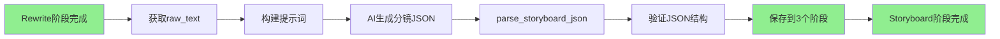

# Storyboard处理器实现分析

> 日期：2026-01-27
> 分析者：Claude Code

---

## 📋 实现位置

**文件：** `apps/content/processors/llm_stage.py`
**处理器：** `LLMStageProcessor(stage_type='storyboard')`

---

## 🔍 核心功能分析

### 1. 输入数据获取（_get_input_data）

**位置：** line 255-267

**逻辑：**
```python
elif self.stage_type == 'storyboard':
    # 分镜生成: 从rewrite阶段的输出获取
    rewrite_stage = ProjectStage.objects.filter(
        project=project,
        stage_type='rewrite',
        status='completed'
    ).first()
    if rewrite_stage and rewrite_stage.output_data:
        return {
            'raw_text': rewrite_stage.output_data.get('raw_text', ''),
            'human_text': ''
        }
    raise ValueError("前置阶段(文案改写)未完成或无输出数据")
```

**关键点：**
- ✅ 依赖rewrite阶段完成
- ✅ 从rewrite的output_data获取raw_text
- ✅ 前置依赖验证（状态检查）

---

### 2. JSON解析（parse_storyboard_json）

**位置：** `apps/projects/utils.py` line 19-47

**功能：**
1. **提取JSON内容** - 从AI生成的文本中提取JSON
   - 移除markdown代码块标记（```json ... ```）
   - 清理空白字符

2. **解析JSON**
   ```python
   storyboard_data = json.loads(clean_json)
   ```

3. **验证数据结构**
   - 必须包含 `scenes` 字段
   - `scenes` 必须是数组类型

4. **验证每个场景的必需字段**
   ```python
   required_fields = ['scene_number', 'narration', 'visual_prompt', 'shot_type']
   ```
   - `scene_number`: 场景编号
   - `narration`: 旁白/解说词
   - `visual_prompt`: 视觉提示
   - `shot_type`: 镜头类型

**错误处理：**
- ✅ JSON解析错误 → ValueError with details
- ✅ 缺少字段 → 明确错误信息
- ✅ 类型错误 → 明确错误信息

---

### 3. 结果保存（_save_result）

**位置：** line 446-463

**逻辑：**
```python
elif self.stage_type == 'storyboard':
    # 分镜生成: 需要解析生成的JSON/结构化文本
    human_text = parse_storyboard_json(generated_text)
    output_data = {
        "human_text": human_text,
        "raw_text": ""
    }
    ProjectStage.objects.filter(
        project=project,
        stage_type__in=["image_generation","camera_movement", "video_generation"]
    ).update(
        input_data=output_data,
        output_data=output_data
    )
```

**关键点：**
- ✅ 解析AI生成的JSON → human_text
- ✅ 批量更新后续3个阶段的input_data和output_data
- ✅ 数据结构：
  ```json
  {
    "human_text": {
      "scenes": [
        {
          "scene_number": 1,
          "narration": "...",
          "visual_prompt": "...",
          "shot_type": "..."
        }
      ]
    },
    "raw_text": ""
  }
  ```

---

## 🎯 数据流程



---

## 📊 数据结构示例

### AI生成的JSON格式

```json
{
  "scenes": [
    {
      "scene_number": 1,
      "narration": "开场镜头，展示产品外观",
      "visual_prompt": "产品特写，明亮背景，专业摄影",
      "shot_type": "特写"
    },
    {
      "scene_number": 2,
      "narration": "展示产品功能演示",
      "visual_prompt": "产品使用场景，自然光，生活化",
      "shot_type": "中景"
    }
  ]
}
```

### 保存到数据库的格式

```json
{
  "input_data": {
    "human_text": { "scenes": [...] },
    "raw_text": ""
  },
  "output_data": {
    "human_text": { "scenes": [...] },
    "raw_text": ""
  }
}
```

---

## ✅ 验证清单

### 功能完整性

- ✅ 输入数据获取（从rewrite阶段）
- ✅ 前置依赖验证
- ✅ JSON解析和验证
- ✅ 结果保存（批量更新3个阶段）
- ✅ 错误处理

### 数据完整性

- ✅ scenes数组验证
- ✅ 必需字段验证
- ✅ JSON格式验证
- ✅ Markdown代码块处理

### 集成完整性

- ✅ 与rewrite阶段集成
- ✅ 为后续3个阶段提供输入
- ✅ 数据流向正确

---

## 🔧 待测试的关键点

### 1. 前置依赖验证

**测试场景：**
- rewrite未完成 → 应抛出ValueError
- rewrite无output_data → 应抛出ValueError
- rewrite已完成 → 应成功获取数据

### 2. JSON解析验证

**测试场景：**
- 有效JSON → 解析成功
- 缺少scenes字段 → 抛出ValueError
- scenes不是数组 → 抛出ValueError
- 场景缺少必需字段 → 抛出ValueError
- Markdown代码块 → 正确提取
- 无效JSON → 抛出ValueError

### 3. 结果保存验证

**测试场景：**
- 正常保存 → 更新3个阶段
- 数据结构正确 → human_text包含scenes
- 返回值正确 → 包含human_text和raw_text

### 4. 流式处理验证

**测试场景：**
- 生成token消息
- 阶段状态更新（pending → processing → completed）
- 错误处理

---

## 📝 测试计划

### 单元测试（预计15个）

1. **初始化测试**（2个）
   - test_init_storyboard_processor
   - test_stage_type_is_storyboard

2. **验证测试**（3个）
   - test_validate_with_completed_rewrite
   - test_validate_without_rewrite_fails
   - test_validate_rewrite_without_output_fails

3. **输入数据测试**（2个）
   - test_get_input_data_from_rewrite
   - test_get_input_data_without_rewrite_raises_error

4. **JSON解析测试**（3个）
   - test_parse_valid_json
   - test_parse_json_missing_scenes_field
   - test_parse_json_missing_required_field

5. **结果保存测试**（2个）
   - test_save_result_updates_three_stages
   - test_save_result_returns_correct_format

6. **流式处理测试**（3个）
   - test_process_stream_yields_tokens
   - test_process_stream_updates_stage_to_completed
   - test_process_stream_handles_json_parsing_error

### 集成测试（预计4个）

1. **完整工作流测试**
   - test_e2e_storyboard_after_rewrite

2. **JSON输出验证**
   - test_storyboard_json_format_validation

3. **顺序约束测试**
   - test_cannot_execute_storyboard_before_rewrite

4. **错误处理测试**
   - test_storyboard_with_invalid_json

---

## 🎓 关键发现

### 优点

1. ✅ **依赖验证完善** - 检查rewrite阶段状态
2. ✅ **JSON验证严格** - 验证数据结构和必需字段
3. ✅ **错误处理清晰** - 明确的错误消息
4. ✅ **数据流向合理** - 批量更新后续阶段

### 潜在改进点

1. ⚠️ **JSON解析容错性**
   - 当前：严格验证必需字段
   - 可选：添加默认值或警告

2. ⚠️ **错误恢复**
   - 当前：JSON解析失败直接抛出错误
   - 可选：尝试修复或部分解析

3. ⚠️ **性能优化**
   - 当前：批量更新3个阶段
   - 可选：仅在需要时更新

---

## 📊 覆盖率目标

**当前覆盖率：** 0%（无专门测试）

**目标覆盖率：** >60%

**预估可达到：** 70-75%

**理由：**
- 核心逻辑清晰，易于测试
- 依赖关系明确
- 错误路径可测

---

## 总结

Storyboard处理器实现**完整且健壮**：
- ✅ 前置依赖验证
- ✅ JSON解析和验证
- ✅ 数据保存完整
- ✅ 错误处理清晰

**下一步：** 添加15个单元测试和4个集成测试，目标覆盖率>60%。
