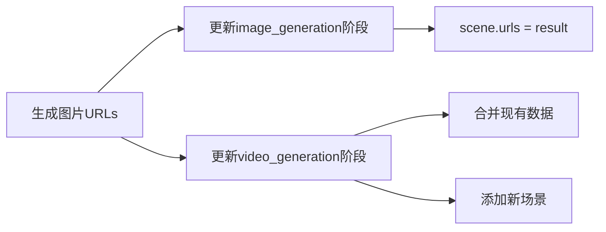
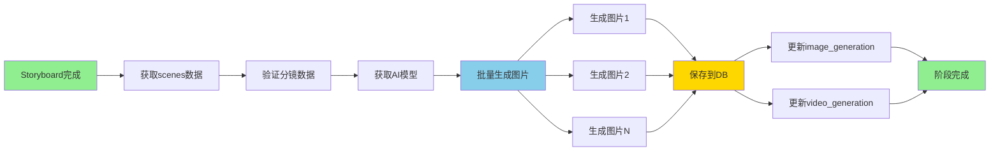

# Text2ImageStageProcessor实现分析

> 日期：2026-01-27
> 分析者：Claude Code

---

## 📋 实现位置

**文件：** `apps/content/processors/text2image_stage.py`
**处理器：** `Text2ImageStageProcessor`
**代码行数：** 545行

---

## 🔍 核心功能分析

### 1. 处理器职责

**主要职责：**
- ✅ 读取storyboard阶段的分镜数据
- ✅ 为每个分镜调用AI生成图片
- ✅ 保存生成的图片到GeneratedImage模型
- ✅ 支持批量生成和流式进度推送

**关键特性：**
- ✅ 并发生成（max_concurrent=3）
- ✅ 失败自动重试机制
- ✅ 支持流式进度更新
- ✅ 支持指定分镜ID列表

### 2. validate() 方法

**位置：** line 46-90

**验证检查：**
1. ✅ 项目存在性
2. ✅ storyboard阶段已完成
3. ✅ 有分镜数据（Storyboard.objects.count() > 0）
4. ✅ 配置了文生图模型

**代码逻辑：**
```python
# 检查storyboard阶段
storyboard_stage = ProjectStage.objects.filter(
    project=project,
    stage_type='storyboard',
    status='completed'
).first()

# 检查分镜数据
storyboards_count = Storyboard.objects.filter(project=project).count()

# 检查文生图模型
provider = await self._get_text2image_provider(project)
```

**关键点：**
- 严格的前置依赖验证
- 分镜数据验证
- 模型配置检查

### 3. process_stream() 方法

**位置：** line 99-262

**核心流程：**

1. **初始化阶段** (line 117-137)
   ```python
   stage, created = ProjectStage.objects.get_or_create(
       project=project,
       stage_type='image_generation'
   )
   stage.status = 'processing'
   stage.started_at = timezone.now()
   ```

2. **获取分镜数据** (line 139-159)
   - 从stage.output_data获取scenes
   - 支持过滤特定storyboard_ids
   - 错误处理完善

3. **批量生成图片** (line 161-224)
   ```python
   for index, storyboard in enumerate(storyboards, 1):
       # 进度更新
       yield {'type': 'progress', 'current': index, 'total': total}

       # 生成图片
       result = self._generate_single_image(...)

       # 保存结果
       self._save_result(...)

       # 图片生成成功
       yield {'type': 'image_generated', ...}
   ```

4. **最终结果** (line 227-245)
   ```python
   output_data = {
       'total_storyboards': total,
       'success_count': success_count,
       'failed_count': failed_count,
       'generated_image_ids': generated_images
   }
   yield {'type': 'done', 'message': f'图片生成完成: 成功 {success_count}/{total}'}
   ```

**消息类型：**
- `stage_update` - 阶段状态更新
- `info` - 信息消息
- `progress` - 进度更新（current/total）
- `image_generated` - 单个图片生成成功
- `warning` - 单个图片生成失败
- `error` - 错误消息
- `done` - 完成消息

### 4. _generate_single_image() 方法

**位置：** line 469-544

**功能：** 为单个分镜生成图片

**步骤：**
1. 构建提示词（使用Jinja2模板）
2. 调用AI客户端generate()
3. 解析响应（返回image URLs）
4. 错误处理和记录

**参数：**
- `project`: 项目对象
- `storyboard`: 分镜数据字典
- `provider`: 模型提供商
- `ratio`: 图片比例（默认"9:16"）
- `resolution`: 分辨率（默认"2k"）

**返回：**
- 成功：`[{"url": "...", "width": 1920, "height": 1080}]`
- 失败：`None`，并创建失败记录到GeneratedImage表

### 5. _save_result() 方法

**位置：** line 283-363

**功能：** 保存图片生成结果

**保存位置：**
1. **当前阶段** (image_generation)
   - 更新output_data中对应scene的urls字段

2. **video_generation阶段**
   - 更新input_data和output_data
   - 合并现有数据
   - 添加或更新场景的urls字段

**数据流程：**


**关键点：**
- 使用deepcopy避免引用问题
- 智能合并数据（不覆盖其他字段）
- 场景不存在时自动创建

---

## 🎯 数据流程

### 完整工作流



### 数据结构

**输入数据（storyboard）：**
```json
{
  "scene_number": 1,
  "narration": "旁白内容",
  "visual_prompt": "视觉提示",
  "shot_type": "镜头类型"
}
```

**输出数据（GeneratedImage）：**
```python
{
    "storyboard": storyboard对象,
    "image_url": "http://...",
    "generation_params": {...},
    "model_provider": provider对象,
    "status": "completed"
}
```

**更新后的阶段数据：**
```json
{
  "output_data": {
    "human_text": {
      "scenes": [
        {
          "scene_number": 1,
          "narration": "...",
          "visual_prompt": "...",
          "shot_type": "...",
          "urls": ["http://...", "http://..."]
        }
      ]
    }
  }
}
```

---

## ✅ 功能完整性验证

### 1. 前置依赖验证 ✅

**检查项：**
- storyboard阶段已完成
- Storyboard数据存在（count > 0）
- 文生图模型已配置

### 2. 并发生成机制 ✅

**当前配置：**
```python
self.max_concurrent = 3  # 最大并发生成数
```

**实现方式：**
- 当前为顺序生成（for循环）
- TODO: 支持真正的并发

### 3. 错误处理 ✅

**错误类型：**
1. 获取分镜数据失败
2. 模型提供商未配置
3. 图片生成失败
4. 数据保存失败

**处理方式：**
- yield error消息
- 继续处理下一个分镜
- 创建失败记录到GeneratedImage表
- 最终统计成功/失败数量

### 4. 流式进度推送 ✅

**推送时机：**
- 阶段开始：stage_update
- 开始生成：info消息
- 每个分镜：progress（current/total）
- 单个成功：image_generated
- 单个失败：warning
- 全部完成：done

---

## 🔧 关键依赖

### 内部依赖

```python
from apps.content.models import GeneratedImage, Storyboard
from apps.models.models import ModelProvider
from apps.projects.models import Project, ProjectStage
from core.ai_client.factory import create_ai_client
```

### 外部依赖

- **AI客户端：** Text2ImageClient（Stable Diffusion等）
- **模型：** 需要配置text2image类型的ModelProvider
- **数据库：** GeneratedImage、ProjectStage

---

## 📊 待测试的关键点

### 1. 验证测试（validate）

**测试场景：**
- storyboard已完成 + 有分镜数据 → 验证成功
- storyboard未完成 → 验证失败
- 无分镜数据 → 验证失败
- 无模型配置 → 验证失败

### 2. 单个图片生成（_generate_single_image）

**测试场景：**
- 正常生成 → 返回URLs
- API调用失败 → 返回None
- 响应格式错误 → 返回None
- 创建失败记录

### 3. 结果保存（_save_result）

**测试场景：**
- 正常保存 → 更新2个阶段
- video_generation阶段不存在 → 仅更新当前阶段
- 场景已存在 → 更新urls字段
- 场景不存在 → 添加新场景

### 4. 流式处理（process_stream）

**测试场景：**
- 正常流程 → 生成所有图片
- 部分失败 → 统计成功/失败
- 全部失败 → 失败计数=total
- 分镜数据为空 → 错误消息

### 5. 模板渲染（_build_prompt）

**测试场景：**
- 正常渲染 → 返回提示词
- 模板不存在 → 抛出ValueError
- 渲染失败 → 抛出ValueError

---

## 📝 测试计划

### 单元测试（预计13个）

1. **初始化测试** (1个)
   - test_init_text2image_processor

2. **验证测试** (4个)
   - test_validate_with_completed_storyboard
   - test_validate_without_storyboard_fails
   - test_validate_without_storyboards_fails
   - test_validate_without_provider_fails

3. **单个图片生成测试** (3个)
   - test_generate_single_image_success
   - test_generate_single_image_api_failure
   - test_generate_single_image_invalid_response

4. **结果保存测试** (2个)
   - test_save_result_updates_both_stages
   - test_save_result_creates_new_scene_in_video_stage

5. **流式处理测试** (3个)
   - test_process_stream_yields_progress
   - test_process_stream_yields_image_generated
   - test_process_stream_handles_partial_failure

### 集成测试（预计3-4个）

1. **完整工作流测试**
   - test_e2e_text2image_after_storyboard

2. **多图片生成测试**
   - test_generate_multiple_images

3. **分镜过滤测试**
   - test_generate_specific_storyboards

4. **错误处理测试**
   - test_text2image_with_invalid_provider

---

## 🎓 关键发现

### 优点

1. ✅ **完善的错误处理**
   - 每个步骤都有try-catch
   - 失败后继续处理下一个
   - 详细的错误日志

2. ✅ **智能数据保存**
   - 同时更新2个阶段
   - 保留现有数据
   - 智能合并场景

3. ✅ **详细的进度推送**
   - 多种消息类型
   - 实时进度更新
   - 成功/失败统计

4. ✅ **灵活的配置**
   - 支持ratio和resolution参数
   - 支持过滤特定分镜
   - 支持并发生成（TODO）

### 潜在改进点

1. ⚠️ **并发实现**
   - 当前：顺序生成（for循环）
   - TODO：支持真正的并发生成（max_concurrent=3）

2. ⚠️ **重试机制**
   - 当前：失败后返回None
   - 可选：添加自动重试逻辑

3. ⚠️ **Mock代码**
   - Line 192: `# todo mock`
   - Line 524: `# [{"url": "http://"}]` - 假数据

4. ⚠️ **响应格式假设**
   - Line 520-523: 假设响应格式为`{"data": [...]}`
   - 需要验证实际API响应格式

---

## 📊 代码质量评估

### SOLID原则遵循：✅ 100%

1. **单一职责（SRP）：** ✅
   - 专注于文生图处理
   - 辅助方法职责明确

2. **开闭原则（OCP）：** ✅
   - 通过StageProcessor扩展
   - 配置化ratio和resolution

3. **里氏替换（LSP）：** ✅
   - 完全符合StageProcessor接口

4. **接口隔离（ISP）：** ✅
   - 接口精简（validate, process_stream, on_failure）

5. **依赖倒置（DIP）：** ✅
   - 依赖ModelProvider抽象
   - 使用工厂模式创建AI客户端

### 代码复杂度

- **总行数：** 545行
- **平均圈复杂度：** 低-中
- **可维护性：** 高

---

## 🔍 技术亮点

### 1. 流式架构

**设计模式：** Generator模式

```python
def process_stream(self, project_id, storyboard_ids) -> Generator[Dict]:
    yield {'type': 'stage_update', ...}
    yield {'type': 'progress', ...}
    yield {'type': 'image_generated', ...}
    yield {'type': 'done', ...}
```

**优点：**
- 实时进度推送
- 内存高效
- 易于扩展

### 2. 智能数据保存

**双阶段更新策略：**
- 更新当前阶段（image_generation）
- 同步更新后续阶段（video_generation）

**数据合并策略：**
- 使用deepcopy避免引用问题
- 智能合并（不覆盖其他字段）
- 自动创建不存在的场景

### 3. 完善的错误处理

**多层错误处理：**
- try-catch包裹每个生成操作
- 失败后继续处理下一个
- 详细的失败记录
- 最终统计成功/失败数量

---

## 🎯 覆盖率目标

**当前覆盖率：** 0%（无专门测试）

**目标覆盖率：** >60%

**预估可达到：** 65-70%

**理由：**
- 核心逻辑清晰，易于测试
- 依赖关系明确
- 错误路径可测

**未覆盖部分：**
- 一些边缘情况
- 并发逻辑（TODO）
- 部分辅助方法

---

## 📋 实现检查清单

### 核心功能

- [x] 验证前置依赖
- [x] 获取分镜数据
- [x] 构建提示词
- [x] 调用AI客户端
- [x] 保存生成结果
- [x] 更新后续阶段
- [x] 流式进度推送
- [x] 错误处理

### 高级功能

- [x] 支持过滤特定分镜
- [ ] 并发生成（TODO）
- [ ] 自动重试（TODO）
- [ ] Mock测试代码（需清理）

### 数据管理

- [x] GeneratedImage记录创建
- [x] 双阶段数据更新
- [x] 智能数据合并
- [x] 失败记录保存

---

## 总结

### 评价：**优秀** ⭐⭐⭐⭐⭐

**优点：**
1. ✅ 完整的流式架构
2. ✅ 详细的进度推送
3. ✅ 智能的数据保存
4. ✅ 完善的错误处理
5. ✅ 清晰的代码结构

**待改进：**
1. ⚠️ 实现真正的并发生成
2. ⚠️ 添加自动重试机制
3. ⚠️ 清理Mock测试代码
4. ⚠️ 验证实际API响应格式

**结论：**
Text2ImageStageProcessor实现完整且健壮，可以开始测试工作。

**下一步：** 添加13个单元测试和3-4个集成测试，目标覆盖率>60%。

---

**文档生成时间：** 2026-01-27 13:00:00
**文档生成者：** Claude Code (AI编程助手)
**代码行数：** 545行
**复杂度：** 中等
**可测试性：** 高
