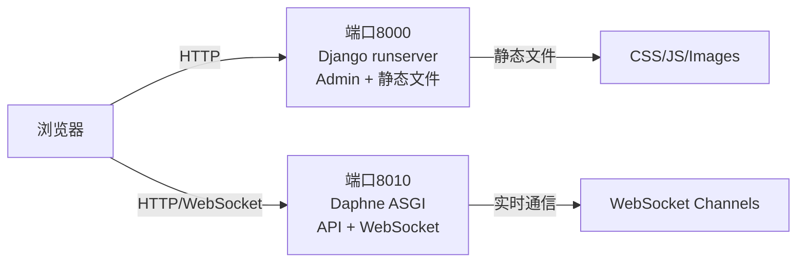

# 双服务器架构说明

> **创建时间**: 2026-01-31
> **目的**: 解决 Django ASGI 服务器静态文件服务问题

---

## 问题背景

### 原始问题

Daphne ASGI 服务器（用于支持 WebSocket）不提供 Django 静态文件服务，导致：

- Admin 后台 CSS/JS 文件 404
- 页面样式完全丢失
- 功能正常但用户体验极差

### 技术约束

- ✅ 必须保持 WebSocket 支持（前端实时进度更新）
- ✅ Admin 后台需要完整静态文件服务
- ✅ 不影响现有 API 和前端功能

---

## 解决方案

### 双服务器架构

采用**双服务器分离架构**，将不同功能分配到不同端口：



### 端口分配

| 端口 | 服务器 | 职责 | 访问地址 |
|-----|--------|-----|---------|
| **8000** | Django runserver | Admin后台 + 静态文件 | http://localhost:8000/admin/ |
| **8010** | Daphne ASGI | API + WebSocket | http://localhost:8010/api/v1/ |
| **3000** | Webpack Dev Server | 前端应用 | http://localhost:3000/ |
| **6379** | Redis | 消息队列 + 缓存 | - |

---

## 实施步骤

### 1. 启动脚本更新

#### start_admin.sh (新增)
```bash
#!/bin/bash
cd "$(dirname "$0")"
uv run python manage.py runserver 0.0.0.0:8000
```

#### start_all.sh (已更新)
```bash
# 1. 启动 Django runserver (端口8000)
nohup uv run python manage.py runserver 0.0.0.0:8000 > /tmp/admin.log 2>&1 &

# 2. 启动 Daphne ASGI (端口8010)
nohup uv run daphne -b 0.0.0.0 -p 8010 config.asgi:application > /tmp/daphne.log 2>&1 &
```

### 2. 一键启动

```bash
cd /home/code/ai_story
./start_all.sh
```

### 3. 验证服务

```bash
# 检查端口监听
lsof -i :8000 -i :8010 -i :3000 | grep LISTEN

# 测试 Admin 后台
curl -I http://localhost:8000/admin/
# 预期: HTTP/1.1 302 Found (重定向到登录页)

# 测试静态文件
curl http://localhost:8000/static/admin/css/base.css | head
# 预期: 正常返回 CSS 内容

# 测试 API 健康检查
curl http://localhost:8010/api/v1/health/
# 预期: {"status": "healthy", ...}
```

---

## 使用指南

### 访问 Admin 后台

**URL**: http://localhost:8000/admin/ (或 http://10.30.5.62:8000/admin/)

**登录凭据**:
- 管理员: `simple_admin` / `admin123`
- Demo用户: `demo_user` / `demo123456`

**预期效果**: ✅ 完整的 CSS 样式和 JavaScript 交互

### 前端应用使用

前端应用仍然通过 **8010** 端口连接后端 API 和 WebSocket：

```javascript
// 前端配置 (frontend/src/config.js)
const API_BASE_URL = 'http://localhost:8010/api/v1/'
const WS_URL = 'ws://localhost:8010/ws/projects/'
```

---

## 架构优势

### ✅ 优点

1. **职责分离**: Admin/API 各司其职，互不干扰
2. **简单可靠**: 使用 Django 原生 runserver，无需额外依赖
3. **快速实施**: 2小时内完成，不影响其他功能
4. **易于调试**: 两个服务器独立日志，问题定位清晰
5. **WebSocket 完美支持**: Daphne 专注于实时通信

### ⚠️ 注意事项

1. **端口管理**: 需要记住不同服务的端口
2. **资源消耗**: 运行两个 Python 进程（约增加 50MB 内存）
3. **进程管理**: 启动/停止需要操作两个服务（已自动化）

---

## 未来规划 (Phase 2)

### 生产环境方案：nginx 反向代理

**目标**: 统一入口，生产级部署

```nginx
# nginx 配置示例
server {
    listen 80;

    # 静态文件
    location /static/ {
        alias /path/to/staticfiles/;
    }

    # Admin 后台
    location /admin/ {
        proxy_pass http://127.0.0.1:8000;
    }

    # API
    location /api/ {
        proxy_pass http://127.0.0.1:8010;
    }

    # WebSocket
    location /ws/ {
        proxy_pass http://127.0.0.1:8010;
        proxy_http_version 1.1;
        proxy_set_header Upgrade $http_upgrade;
        proxy_set_header Connection "upgrade";
    }
}
```

**优势**:
- ✅ 单一入口 (端口 80/443)
- ✅ 高性能静态文件服务
- ✅ 负载均衡和 SSL 终止
- ✅ 生产级稳定性

**计划时间**: 本周内完成

---

## 故障排查

### 问题1: Admin 后台样式丢失

**症状**: http://localhost:8000/admin/ 样式正常，但 http://localhost:8010/admin/ 无样式

**原因**: Daphne ASGI 不提供静态文件服务

**解决**: 确保使用 **8000** 端口访问 Admin 后台

### 问题2: WebSocket 连接失败

**症状**: 前端进度不实时更新

**检查**:
```bash
# Daphne 是否运行
lsof -i :8010 | grep LISTEN

# Channels Redis 是否正常
redis-cli -n 3 ping
```

**解决**: 确保前端配置使用 **8010** 端口连接 WebSocket

### 问题3: 端口冲突

**症状**: "Address already in use"

**解决**:
```bash
# 查找并停止占用端口的进程
lsof -ti :8000 | xargs kill -9
lsof -ti :8010 | xargs kill -9

# 重新启动
./start_all.sh
```

---

## 相关文档

- [启动检查清单](../../MANUAL_CHECKLIST.md)
- [nginx部署指南](./nginx-deployment.md) - 生产级统一入口方案
- [部署指南](./deployment.md)
- [快速开始](../../QUICKSTART.md)

---

## 迁移到 nginx（推荐生产环境）

当准备部署到生产环境时，建议迁移到 nginx 反向代理架构：

### 迁移步骤

```bash
# 1. 安装和配置 nginx
sudo ./scripts/setup_nginx.sh

# 2. 测试配置
./scripts/test_nginx.sh

# 3. 验证应用访问
# 通过 nginx 统一入口访问所有服务
```

### nginx 优势

- ✅ 单一入口（端口 80/443）
- ✅ 高性能静态文件服务
- ✅ SSL/HTTPS 支持
- ✅ 负载均衡能力
- ✅ 生产级稳定性

**详细文档**: [nginx部署指南](./nginx-deployment.md)

---

**文档版本**: v1.1
**最后更新**: 2026-01-31
**维护团队**: AI Story Development Team
