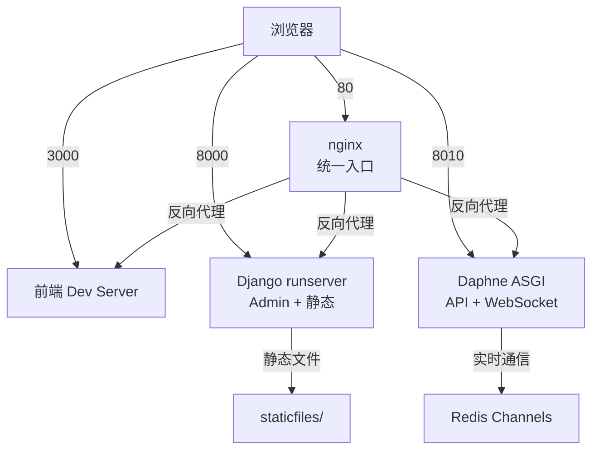

# AI Story 部署快速参考

> **最后更新**: 2026-01-31

## 🚀 快速启动

```bash
# 启动所有服务（双服务器架构）
cd /home/code/ai_story
./start_all.sh
```

---

## 📱 访问地址

### 开发环境（直接访问）

| 服务 | URL | 端口 | 说明 |
|-----|-----|------|------|
| **前端应用** | http://localhost:3000/ | 3000 | Vue Dev Server |
| **Admin后台** | http://localhost:8000/admin/ | 8000 | Django Admin (完整样式) |
| **后端API** | http://localhost:8010/api/v1/ | 8010 | REST API + WebSocket |
| **API文档** | http://localhost:8010/api/schema/ | 8010 | Swagger UI |

### 开发环境（通过 nginx）

**安装**: `sudo ./scripts/setup_nginx.sh`

| 服务 | URL | 说明 |
|-----|-----|------|
| **所有服务** | http://localhost/ | 统一入口 |
| 前端 | http://localhost/ | 自动路由 |
| Admin | http://localhost/admin/ | 完整样式 |
| API | http://localhost/api/v1/ | REST API |
| WebSocket | ws://localhost/ws/projects/{id}/ | 实时通信 |

### 生产环境（nginx + SSL）

| 服务 | URL | 说明 |
|-----|-----|------|
| **所有服务** | https://your-domain.com/ | HTTPS 统一入口 |
| 前端 | https://your-domain.com/ | 静态文件服务 |
| Admin | https://your-domain.com/admin/ | 完整样式 |
| API | https://your-domain.com/api/v1/ | REST API |
| WebSocket | wss://your-domain.com/ws/projects/{id}/ | 安全 WebSocket |

---

## 🔑 测试账户

| 角色 | 用户名 | 密码 | 用途 |
|-----|--------|------|------|
| **Demo用户** | demo_user | demo123456 | 前端应用测试 |
| **管理员** | simple_admin | admin123 | Admin后台管理 |

---

## 📊 服务端口映射



### 端口说明

| 端口 | 服务 | 进程 | 日志 |
|-----|------|------|------|
| 80 | nginx (开发) | nginx | /var/log/nginx/ai-story-*.log |
| 443 | nginx (生产) | nginx | /var/log/nginx/ai-story-*.log |
| 8000 | Django Admin | python3 | /tmp/admin.log |
| 8010 | Daphne ASGI | daphne | /tmp/daphne.log |
| 3000 | 前端 Dev Server | webpack/npm | /tmp/frontend.log |
| 6379 | Redis | redis-server | - |

---

## 🛠️ 常用命令

### 服务管理

```bash
# 启动所有服务
./start_all.sh

# 停止所有服务
source /tmp/ai_story_pids.sh && stop_all

# 查看服务状态
source /tmp/ai_story_pids.sh && status

# 重启单个服务
kill <PID> && ./start_all.sh
```

### nginx 管理

```bash
# 安装和配置
sudo ./scripts/setup_nginx.sh

# 测试配置
./scripts/test_nginx.sh

# 查看 nginx 状态
sudo systemctl status nginx

# 重启 nginx
sudo systemctl restart nginx

# 重新加载配置（零停机）
sudo systemctl reload nginx

# 查看 nginx 日志
sudo tail -f /var/log/nginx/ai-story-error.log
```

### 后端管理

```bash
# 收集静态文件
cd backend
uv run python manage.py collectstatic --noinput

# 数据库迁移
uv run python manage.py migrate

# 创建超级用户
uv run python manage.py createsuperuser

# Django Shell
uv run python manage.py shell
```

### Celery 管理

```bash
# 查看 Celery 状态
cd backend
uv run celery -A config inspect active

# 清空任务队列
redis-cli -n 0 flushdb

# 查看 Celery 日志
tail -f /tmp/celery.log
```

---

## 🔍 故障排查

### 快速诊断

```bash
# 1. 检查所有端口
lsof -i :80 :8000 :8010 :3000 :6379

# 2. 检查服务进程
ps aux | grep -E "nginx|daphne|runserver|celery|webpack"

# 3. 测试端点
curl http://localhost/api/v1/health/
curl http://localhost/admin/
curl http://localhost/static/admin/css/base.css
```

### 常见问题

| 问题 | 症状 | 解决方案 |
|-----|------|----------|
| Admin 样式丢失 | CSS/JS 404 | 使用端口 8000 或安装 nginx |
| WebSocket 断开 | 进度不更新 | 检查 Daphne (8010) 和 Redis |
| 502 Bad Gateway | nginx 无法连接后端 | 检查 8000/8010 端口服务 |
| 静态文件 404 | 资源加载失败 | 运行 `collectstatic` |

---

## 📁 重要文件

### 配置文件

| 文件 | 用途 |
|-----|------|
| `.env` | 环境变量配置 |
| `backend/config/settings/base.py` | Django 核心配置 |
| `backend/config/asgi.py` | ASGI 服务器配置 |
| `deploy/nginx/ai-story-dev.conf` | nginx 开发配置 |
| `deploy/nginx/ai-story-prod.conf` | nginx 生产配置 |

### 启动脚本

| 脚本 | 用途 |
|-----|------|
| `start_all.sh` | 启动所有后端服务 |
| `backend/start_admin.sh` | 单独启动 Admin (8000) |
| `backend/run_asgi.sh` | 单独启动 Daphne (8010) |
| `scripts/setup_nginx.sh` | 安装和配置 nginx |
| `scripts/test_nginx.sh` | 测试 nginx 配置 |

### 日志文件

| 日志 | 位置 |
|-----|------|
| Admin 服务器 | /tmp/admin.log |
| ASGI 服务器 | /tmp/daphne.log |
| Celery Worker | /tmp/celery.log |
| 前端编译 | /tmp/frontend.log |
| nginx 访问 | /var/log/nginx/ai-story-access.log |
| nginx 错误 | /var/log/nginx/ai-story-error.log |

---

## 📚 文档导航

- [快速开始](../../QUICKSTART.md) - 5分钟上手指南
- [双服务器架构](./dual-server-architecture.md) - 架构设计说明
- [nginx部署指南](./nginx-deployment.md) - 生产级部署
- [启动检查清单](../../MANUAL_CHECKLIST.md) - 完整验证流程
- [故障排查指南](../troubleshooting/) - 详细问题解决

---

## 🎯 架构对比

### 开发环境（双服务器）

```
优点:
  ✅ 快速启动
  ✅ 无需额外依赖
  ✅ 独立日志

缺点:
  ❌ 多端口访问
  ❌ 需要记住端口号
  ❌ 无统一入口
```

### 生产环境（nginx）

```
优点:
  ✅ 统一入口（端口 80/443）
  ✅ 高性能静态文件
  ✅ SSL/HTTPS 支持
  ✅ 负载均衡能力

缺点:
  ❌ 需要安装 nginx
  ❌ 配置稍复杂
```

---

**更新时间**: 2026-01-31
**适用版本**: v1.0
